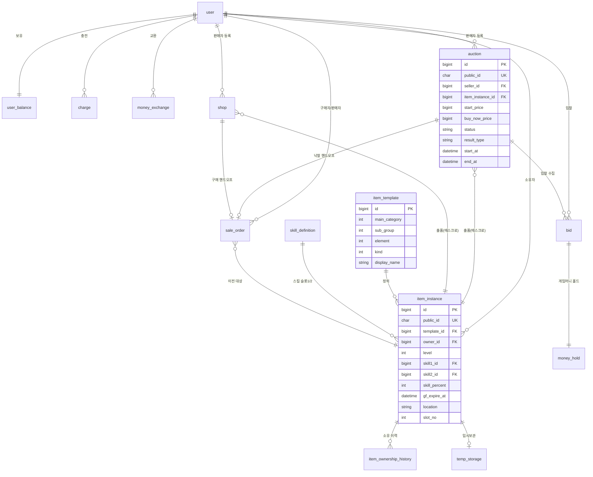

# FinalCall ERD (데이터 모델)

상태: DRAFT v0.1 — G2 미승인 (초안 완성. 총괄 검수 + domain-spec 정합 확인 → 사용자 승인)
소유: 기획/설계
근거: domain-spec v0.2, D-036(형식 골격), D-044~047·D-062·D-066(아이템), D-050~053(사용자·화폐), D-005·D-008(경매), B-001~009(기술 규약)
형식: D-036 — 네이밍 선언부 / Mermaid erDiagram / 테이블 정의 표 / 인덱스 표(이유 열) / Flyway 매핑

| 버전 | 날짜 | 내용 |
|---|---|---|
| v0 | 2026-07-13 | 골격 착수 — 네이밍 선언부·엔티티 개요·Mermaid |
| v0.1 | 2026-07-13 | 테이블 정의(§4, 14개)·인덱스 표(§5)·Flyway(§6) 작성. 네이밍(auction/shop/sale_order)·위치 디스크리미네이터 확정. G2 검수 대기 |
| v0.2 | 2026-07-13 | G2 통과. D-067 반영 — 시드 '가상' 제약 해제(원게임 실제 데이터·코드), skill_code 원게임 대응 정식화. G2 관찰: shop(item_instance_id) 인덱스 추가 |
| v0.3 | 2026-07-14 | 보안 델타(계약 v0.2) 정합 — charge.pg_tx_id UK(멱등 앵커, SEC-001), item_template.type_code 외부 식별자 UK(035) |
| v0.4 | 2026-07-14 | §6 Flyway 매핑 6절 정정(B-012) — 스켈레톤 V1·V2 소비 반영, 도메인은 V3부터. erd는 그룹·순서만 규정, 구체 채번은 백엔드 동기화 |
| v0.5 | 2026-07-14 | D-073 반영 — item_template.grade 제거, 유니크 (main_category,sub_group,element,kind), §5 인덱스 (element,kind), Mermaid 정정 |

확정: 플래그 A(order명 `sale_order`)·B(위치 디스크리미네이터) 모두 확정(1절·2절). G2 통과(2026-07-13). 남은 미확정 — 플랫폼 수수료 정책(ON-HOLD), 캐시↔게임머니 교환비율(ON-HOLD), 아이템 시드 멤버·명칭·수치(원게임 데이터, 시드 단계, D-067).

---

## 1. 네이밍 규칙 선언부 (B-001~004)

백엔드 확정 기술 규약을 ERD 표기 기준으로 선언한다. 이 규칙이 전 테이블에 적용된다.

- 테이블: 단수 + snake_case (JPA 자동 변환 전제). 예: `user`, `auction`, `item_instance`.
- PK: `id BIGINT AUTO_INCREMENT`, 단일 대리키. 자연키는 PK로 쓰지 않고 유니크 제약으로 표현.
- FK: `<참조테이블>_id` (역할 접두 허용, 예: `seller_id`, `buyer_id`). 물리 FK로 시작.
- 외부 노출 식별자: `public_id`(ULID, char/varchar). 외부 노출 리소스(user·auction·shop·item_instance 등)에 부여. 내부 조인·FK는 `id`.
- 시간: `DATETIME(6)` UTC 저장, 컬럼 접미 `_at`. (Instant/UTC — CLAUDE.md 정합)
- soft delete: `is_deleted`(bool) + `deleted_at`. soft delete 테이블의 자연키 유니크는 삭제 식별 컬럼을 포함(삭제행-신규행 충돌 회피).
- 상태 enum: 대문자 문자열(예: `SCHEDULED`,`ACTIVE`,`SOLD`).

테이블 네이밍 확정(2026-07-13, 사용자): 경매 = `auction`, 고정가 = `shop`(별도 구조 유지, P-001 불변). 도메인 용어 "경매(Auction)/고정가(FixedSale)"는 domain-spec 유지, 물리 테이블만 매핑(auction / shop).

Order 테이블명 확정(2026-07-13, 사용자): `sale_order`. 판매 성립(SOLD) 거래 레코드로 경매 낙찰 + shop 구매 공통 핸드오프(§5 구매 경로 단일화). 접두어(tb_) 미도입 — B-001 단수 규칙 유지, 예약어 `order`는 단수 합성어 `sale_order`로 회피(규칙 예외 불요).

---

## 2. 엔티티 개요

도메인별 엔티티. 상세 컬럼은 4절 테이블 표, 관계는 3절 Mermaid.

거래 주체·화폐 (D-050~053)
- `user` — 단일 사용자. 관리자 = 권한 플래그. 로그인 식별.
- `user_balance` — 사용자별 잔액: 캐시 / 게임머니 (1:1).
- `charge` — 캐시 충전(토스 테스트 결제). 별도 도메인, 콜백 검증·멱등키.
- `money_exchange` — 캐시↔게임머니 교환 이력(교환 비율 파라미터, ON-HOLD).
- `money_hold` — 입찰 시 게임머니 홀드(에스크로). 입찰 1건 대응.

판매·거래 (P-001, D-005, D-008)
- `auction` — 영국식 경매(+즉시구매 선택). item_instance 1건 보유(에스크로).
- `bid` — 경매 입찰. money_hold 연계.
- `shop` — 고정가 판매(domain-spec 용어 FixedSale/고정가 ↔ 테이블 shop). item_instance 1건 보유(에스크로).
- `sale_order` — 판매 성립(SOLD) 시 생성되는 거래(결제·정산·소유 이전). 경매·고정가 공통 핸드오프.

아이템 (D-044~047·D-062·D-066)
- `item_template` — 아이템 정의 마스터. 타입코드 정규화(대분류·중분류·속성·종류) + 표시명(원게임 시드). 등급 축 없음(D-073).
- `skill_definition` — 특수스킬 정의 마스터(가상 시드). 인스턴스 스킬 슬롯이 참조.
- `item_instance` — 개별 아이템. template FK + 레벨·스킬 2슬롯·발동확률·골드포스 + 소유자 + 위치.
- `item_ownership_history` — 소유 이전 이력(최초·직전·전체 체인). 비거래 이전도 통합.
- `temp_storage` — 임시보관(오버플로우). 상한 없음. 보관 기한(선택).

결정 플래그 B (위치 단일진실 — 확정 2026-07-13, 사용자): `item_instance.location`(enum INVENTORY/TEMP/LISTED) 단일 디스크리미네이터. INVENTORY일 때만 `slot_no`(0~95), TEMP일 때 `temp_storage` 행 존재, LISTED일 때 활성 리스팅(auction/shop)이 참조. XOR 불변식은 앱 + DB 제약으로 강제.

---

## 3. Mermaid erDiagram (골격)

관계와 핵심 키만 표기. 전체 컬럼은 4절 표.

주: 위 Mermaid는 골격이다. money_hold·sale_order·정산 상세, 소프트 클로즈 연장 컬럼, 화폐 잔액 컬럼 등은 4절 테이블 표에서 확정한다.

---

## 4. 테이블 정의 표

공통 컬럼(모든 테이블): `id BIGINT PK AUTO_INCREMENT`, `created_at DATETIME(6)`. 갱신 대상은 `updated_at`.
아래 표는 도메인 고유 컬럼 위주로 적고 공통 컬럼은 생략한다. 타입은 논리 타입(백엔드 구현 시 확정).

### 4.1 사용자·화폐/홀드 (D-050~053)

table `user` — 단일 사용자(관리자=플래그). 인증 상세 필드는 api-contract auth 섹션에서 확정(D-002).

| 컬럼 | 타입 | 널 | 키 | 설명 |
|---|---|---|---|---|
| public_id | ULID | N | UK | 외부 노출 식별자(B-004) |
| login_id | VARCHAR | N | UK | 로그인 식별자 |
| password_hash | VARCHAR | N | | 비밀번호 해시 |
| nickname | VARCHAR | N | UK | 표시명 |
| is_admin | BOOLEAN | N | | 관리자 권한 플래그(기본 false) |
| is_deleted | BOOLEAN | N | | soft delete |
| deleted_at | DATETIME(6) | Y | | |

table `user_balance` — 사용자별 잔액(1:1). 잔액 갱신은 원자적(D-008).

| 컬럼 | 타입 | 널 | 키 | 설명 |
|---|---|---|---|---|
| user_id | BIGINT | N | UK, FK→user | 1:1 |
| cash_balance | BIGINT | N | | 캐시 잔액(충전 화폐) |
| game_money_balance | BIGINT | N | | 게임머니 잔액(거래 화폐) |
| game_money_held | BIGINT | N | | 홀드 합계(가용 = balance − held) |

table `charge` — 캐시 충전(토스 테스트 결제). 별도 도메인, 거래 TX와 분리(D-051·D-053).

| 컬럼 | 타입 | 널 | 키 | 설명 |
|---|---|---|---|---|
| public_id | ULID | N | UK | |
| user_id | BIGINT | N | FK→user | |
| amount | BIGINT | N | | 충전 캐시액 |
| status | ENUM | N | | READY / APPROVED / FAILED |
| idempotency_key | VARCHAR | Y | | 요청 재시도 편의 보조(멱등 앵커는 pg_tx_id, SEC-001) |
| pg_tx_id | VARCHAR | Y | UK | PG 승인 식별자(paymentKey) — 멱등 앵커. 동일 승인 재반영 DB 차단(SEC-001) |
| approved_at | DATETIME(6) | Y | | |

table `money_exchange` — 캐시↔게임머니 교환. 교환 비율은 파라미터(ON-HOLD, 추적표).

| 컬럼 | 타입 | 널 | 키 | 설명 |
|---|---|---|---|---|
| user_id | BIGINT | N | FK→user | |
| cash_amount | BIGINT | N | | 차감 캐시 |
| game_money_amount | BIGINT | N | | 지급 게임머니 |
| applied_rate | DECIMAL | N | | 적용 교환 비율(당시 파라미터 스냅샷) |

table `money_hold` — 입찰 시 게임머니 홀드(에스크로, D-052). 상위 입찰 시 즉시 해제(P-008), 낙찰 시 차감.

| 컬럼 | 타입 | 널 | 키 | 설명 |
|---|---|---|---|---|
| user_id | BIGINT | N | FK→user | 입찰자 |
| bid_id | BIGINT | N | UK, FK→bid | 홀드-입찰 1:1 |
| amount | BIGINT | N | | 홀드 게임머니 |
| status | ENUM | N | | HELD / RELEASED / CAPTURED |
| released_at | DATETIME(6) | Y | | 해제·차감 시각 |

### 4.2 경매·입찰·고정가·주문 (P-001, D-004·005·008, §5)

table `auction` — 영국식 경매(+즉시구매 선택). 종료 전이는 CAS 단일 승자(D-008). 소프트클로즈로 `end_at` 동적 갱신(D-004).

| 컬럼 | 타입 | 널 | 키 | 설명 |
|---|---|---|---|---|
| public_id | ULID | N | UK | |
| seller_id | BIGINT | N | FK→user | 판매자 |
| item_instance_id | BIGINT | N | FK→item_instance | 출품 아이템(에스크로) |
| start_price | BIGINT | N | | 시작가 |
| buy_now_price | BIGINT | Y | | 즉시구매가(선택, > start_price, P-002) |
| status | ENUM | N | | SCHEDULED/ACTIVE/SOLD/UNSOLD/CANCELLED |
| result_type | ENUM | Y | | BID/BUYNOW (SOLD일 때) |
| highest_bid_amount | BIGINT | Y | | 현재 최고가(비정규화, 빠른 조회) |
| highest_bidder_id | BIGINT | Y | FK→user | 현재 최고 입찰자 |
| start_at | DATETIME(6) | Y | | 예약 시작(SCHEDULED→ACTIVE 트리거) |
| end_at | DATETIME(6) | N | | 마감 시각(소프트클로즈로 갱신) |
| base_end_at | DATETIME(6) | N | | 최초 마감(연장 기준) |
| max_end_at | DATETIME(6) | N | | 총연장 상한 — 초과 연장 불가(D-004) |
| soft_close_window_sec | INT | N | | 트리거 윈도우(경매별 설정) |
| soft_close_extend_sec | INT | N | | 연장폭 |
| extension_count | INT | N | | 누적 연장 횟수 |
| item_name_snapshot | VARCHAR | N | | 등록 시점 표시명 스냅샷(D-045) |
| item_spec_snapshot | VARCHAR | N | | 등록 시점 핵심 스펙 요약 스냅샷 |

table `bid` — 경매 입찰(D-004). 자기·연속 입찰 금지는 앱 검증. 홀드는 `money_hold`가 참조.

| 컬럼 | 타입 | 널 | 키 | 설명 |
|---|---|---|---|---|
| auction_id | BIGINT | N | FK→auction | |
| bidder_id | BIGINT | N | FK→user | 입찰자 |
| amount | BIGINT | N | | 입찰액(< buy_now_price, D-004) |
| status | ENUM | N | | ACTIVE/OUTBID/WON |

table `shop` — 고정가 판매(구매 = 원자적 선점 CAS, D-008). 도메인 용어 FixedSale/고정가.

| 컬럼 | 타입 | 널 | 키 | 설명 |
|---|---|---|---|---|
| public_id | ULID | N | UK | |
| seller_id | BIGINT | N | FK→user | 판매자 |
| item_instance_id | BIGINT | N | FK→item_instance | 출품 아이템(에스크로) |
| price | BIGINT | N | | 고정 판매가 |
| status | ENUM | N | | ACTIVE/SOLD/EXPIRED/CANCELLED |
| end_at | DATETIME(6) | Y | | 선택 판매 기한(만료 시 EXPIRED) |
| item_name_snapshot | VARCHAR | N | | 등록 시점 표시명 스냅샷(D-045) |
| item_spec_snapshot | VARCHAR | N | | 등록 시점 핵심 스펙 요약 스냅샷 |

table `sale_order` — 판매 성립 거래(경매 낙찰 + shop 구매 공통, §5). 정산·소유이전 단일 TX(D-053).

| 컬럼 | 타입 | 널 | 키 | 설명 |
|---|---|---|---|---|
| public_id | ULID | N | UK | |
| source_type | ENUM | N | | AUCTION / SHOP (출처 구분) |
| source_id | BIGINT | N | | 출처 리스팅 id(auction.id 또는 shop.id) |
| buyer_id | BIGINT | N | FK→user | 구매자 |
| seller_id | BIGINT | N | FK→user | 판매자 |
| item_instance_id | BIGINT | N | FK→item_instance | 이전 대상 |
| final_price | BIGINT | N | | 최종 낙찰가/구매가 |
| fee_amount | BIGINT | Y | | 플랫폼 수수료(정책 ON-HOLD, 028 — 자리만) |
| settle_amount | BIGINT | N | | 판매자 정산액(= final_price − fee) |
| status | ENUM | N | | SETTLED (내부 DB 단일 TX) |
| settled_at | DATETIME(6) | N | | 정산 완료 시각 |

주: `source_type + source_id` 폴리모픽 참조(플래그 논의 채택 a). 물리 FK 제약이 약해지는 대신 채널 확장에 유연.

### 4.3 아이템 (D-044~047·D-062·D-066)

table `item_template` — 아이템 정의 마스터. 타입코드 정규화(①). 고정 시드(Flyway). taxonomy 멤버 값·명칭은 원게임(SurvivalProject) 실제 데이터로 시드에서 확정(D-067).

| 컬럼 | 타입 | 널 | 키 | 설명 |
|---|---|---|---|---|
| main_category | INT | N | | 대분류(예: 무기) — 타입코드 천의 자리 |
| sub_group | INT | N | | 중분류/슬롯군(무기·방어구/장신구·필드) — 백의 자리 |
| element | INT | N | | 속성(물/불/흙/바람) — 십의 자리 |
| kind | INT | N | | 종류(검·도·활·방·펜…) — 일의 자리 |
| type_code | INT | N | UK | 자리값 합성 코드 — item_template 외부 식별자(035, public_id 미부여) |
| display_name | VARCHAR | N | | 표시명(원게임 데이터, 시드) |

유니크: (main_category, sub_group, element, kind) 조합 1건. (등급 축 제거, D-073)

table `skill_definition` — 특수스킬 정의 마스터(②). 원게임(SurvivalProject) 스킬 데이터 시드. 인스턴스 슬롯1/2가 참조.

| 컬럼 | 타입 | 널 | 키 | 설명 |
|---|---|---|---|---|
| skill_code | INT | N | UK | 원게임 스킬 ID(100~435) |
| name | VARCHAR | N | | 스킬명(원게임 데이터, 시드) |
| description | VARCHAR | Y | | 설명 |

주: 슬롯1/2에 올 수 있는 유효 스킬 풀(장비 종류별 상이)은 시드·검증 규칙으로 관리(테이블 모델 밖).

table `item_instance` — 개별 아이템(D-045, ②③④⑤). 위치 디스크리미네이터(플래그 B).

| 컬럼 | 타입 | 널 | 키 | 설명 |
|---|---|---|---|---|
| public_id | ULID | N | UK | 외부 식별자(itm_uuid 대응, B-004) |
| template_id | BIGINT | N | FK→item_template | 아이템 정의 |
| owner_id | BIGINT | N | FK→user | 현재 소유자(④) |
| level | INT | N | | 레벨(표시 1~9) |
| skill1_id | BIGINT | Y | FK→skill_definition | 특수스킬 슬롯1(②) |
| skill2_id | BIGINT | Y | FK→skill_definition | 특수스킬 슬롯2 |
| skill_percent | INT | N | | 스킬 발동확률(합성 결과, ②) |
| gf_expire_at | DATETIME(6) | Y | | 골드포스 만료시각(③). 활성/잔여는 파생 |
| location | ENUM | N | | INVENTORY / TEMP / LISTED (위치 단일진실, 플래그 B) |
| slot_no | INT | Y | | INVENTORY일 때 인벤토리 슬롯(0~95). 그 외 NULL |

불변식(XOR): location=INVENTORY ⇒ slot_no NOT NULL · temp_storage 행 없음 / TEMP ⇒ slot_no NULL · temp_storage 행 존재 / LISTED ⇒ 활성 auction·shop이 참조. 앱 + 제약 강제.

table `item_ownership_history` — 소유 이전 이력(④). 최초 소유자 = 인스턴스별 첫 행(별도 캐시 컬럼 없음).

| 컬럼 | 타입 | 널 | 키 | 설명 |
|---|---|---|---|---|
| instance_id | BIGINT | N | FK→item_instance | |
| from_owner_id | BIGINT | Y | FK→user | 이전 소유자(최초 발행 시 NULL) |
| to_owner_id | BIGINT | N | FK→user | 새 소유자 |
| transfer_type | ENUM | N | | TRADE / ADMIN_GRANT / SEED |
| sale_order_id | BIGINT | Y | FK→sale_order | 거래 이전일 때 연계 |
| transferred_at | DATETIME(6) | N | | 이전 시각 |

table `temp_storage` — 임시보관(오버플로우, ⑤-2). location=TEMP일 때만 행 존재. 상한 없음.

| 컬럼 | 타입 | 널 | 키 | 설명 |
|---|---|---|---|---|
| instance_id | BIGINT | N | UK, FK→item_instance | 1:1 |
| owner_id | BIGINT | N | FK→user | |
| stored_at | DATETIME(6) | N | | 임시보관 시각 |
| expire_at | DATETIME(6) | Y | | 선택 보관 기한(회수 규칙 미확정) |

## 5. 인덱스 표 (이유 열 필수, D-036)

PK·UK(4절 표기)는 생략하고, 조회·정합·마감·검색 목적의 보조 인덱스만 이유와 함께 적는다.
정렬·필터 화이트리스트는 인덱스와 1:1이어야 한다(B-006). 구체 튜닝·복합 순서는 백엔드 부하 실측으로 조정.

| 테이블 | 인덱스(컬럼) | 이유 |
|---|---|---|
| item_instance | (template_id, level, skill1_id, skill2_id) | 시세 집계 단위(§7.7, D-044 조건). "동일 템플릿 다른 가치"를 이 조합 키로 집계. 골드포스 제외(D-066) |
| item_instance | (skill1_id, skill2_id) | 특수스킬 조합 필터(§7.7). 스킬만으로 매물 탐색 |
| item_instance | (gf_expire_at) | 골드포스 활성/잔여 필터·정렬(D-066, 검색 전용·시세 키 제외) |
| item_instance | (owner_id, location, slot_no) | 사용자 인벤토리 조회(정규 슬롯 나열), 위치별 분리 |
| item_template | (element, kind) | 속성·종류 부분 필터 검색(§7.7). 대분류·중분류와 조합 |
| auction | (status, end_at) | 마감 트리거 DB 재구축 스캔(status=ACTIVE AND end_at<=now, D-058). 지연 인덱스 유실 복구 |
| auction | (status, start_at) | 예약 시작(SCHEDULED→ACTIVE) 트리거 스캔(D-057) |
| auction | (seller_id, status) | 판매자 진행/종료 경매 목록 |
| auction | (item_instance_id) | 출품 아이템 역참조(에스크로 상태 확인) |
| bid | (auction_id, amount DESC) | 경매별 최고가·입찰 내역 조회 |
| bid | (bidder_id) | 사용자 입찰 내역, 연속 입찰 금지 검증 |
| shop | (status, end_at) | 고정가 만료(EXPIRED) 트리거 스캔(D-057) |
| shop | (seller_id, status) | 판매자 고정가 목록 |
| shop | (item_instance_id) | 출품 아이템 역참조(에스크로 상태 확인, auction 대칭 — G2 관찰 #3) |
| sale_order | (source_type, source_id) | 출처 리스팅 역참조(중복 성립 방지 보조) |
| sale_order | (buyer_id), (seller_id) | 구매/판매 거래 내역 |
| charge | (user_id, status) | 사용자 충전 내역·진행 상태 |
| money_hold | (user_id, status) | 사용자 홀드 합계·해제 대상 조회 |
| item_ownership_history | (instance_id, transferred_at) | 인스턴스 소유 체인 조회(최초=첫 행) |
| temp_storage | (owner_id) | 사용자 임시보관 목록 |

정합성 인덱스·제약(D-008):
- 종료성 전이(auction·shop status)는 조건부 CAS UPDATE(WHERE status='ACTIVE')로 단일 승자. 별도 인덱스보다 status 조건이 핵심.
- 출품 중복 방지는 item_instance.location 전이(INVENTORY→LISTED) CAS 단일 승자로 보증(플래그 B). "활성 리스팅 instance 유니크"용 부분 유니크 인덱스는 불요.
- charge.idempotency_key UK로 충전 콜백 멱등(D-051).

## 6. Flyway 매핑 (D-036, B-012 정정)

`classpath:db/migration`, 네이밍 `V<N>__<설명>.sql`, append-only. 스켈레톤이 V1(init_schema)·V2(notice_auditor)를 이미 소비하므로 도메인 마이그레이션은 V3부터 채번한다.

erd는 마이그레이션 그룹·순서만 규정하고, 구체 V-번호 채번은 구현 진행에 맞춰 백엔드가 정보 공유로 동기화한다(B-012). 확정 스펙에 변동적 채번을 고정하지 않아 구현 단위 분할 시 반복 정정을 피한다.

마이그레이션 그룹·순서(스켈레톤 소비분 V1·V2 이후 V3부터):
1. 사용자·잔액 — user, user_balance (백엔드 `V3__user_and_balance`부터, B-012)
2. 화폐 — charge, money_exchange, money_hold (후속 버전 분리)
3. 아이템 — item_template, skill_definition, item_instance, item_ownership_history, temp_storage + 인덱스
4. 판매·거래 — auction, bid, shop, sale_order + 인덱스·FK
5. 아이템 시드 — item_template·skill_definition 고정 시드(원게임 실제 명칭·수치·코드, D-067)

주: 스켈레톤 규약 `JPA_DDL_AUTO=validate`(전 프로파일) — 스키마는 Flyway가 소유. 실제 V-번호·단위 분할은 백엔드 정보 공유로 동기화한다. 아이템 시드의 taxonomy 멤버·명칭·수치·타입코드는 원게임(SurvivalProject) 데이터로 시드 확정 단계에서 작성(D-066·D-067).
