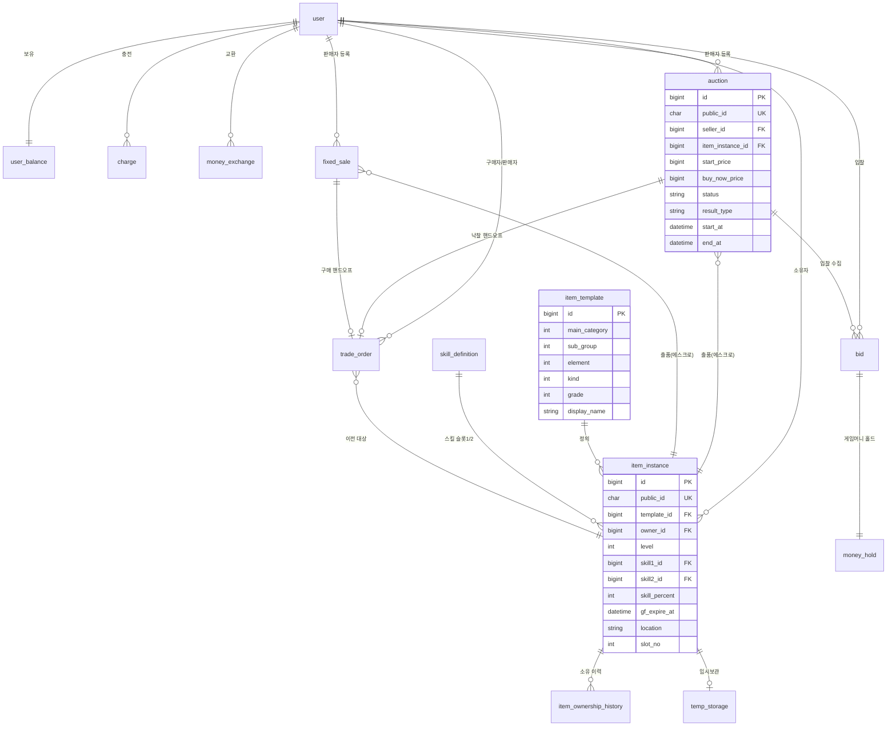

# FinalCall ERD (데이터 모델)

상태: DRAFT v0 — G2 미승인 (기획 초안 → 총괄 검수 + domain-spec 정합 확인 → 사용자 승인)
소유: 기획/설계
근거: domain-spec v0.2, D-036(형식 골격), D-044~047·D-062·D-066(아이템), D-050~053(사용자·화폐), D-005·D-008(경매), B-001~009(기술 규약)
형식: D-036 — 네이밍 선언부 / Mermaid erDiagram / 테이블 정의 표 / 인덱스 표(이유 열) / Flyway 매핑

| 버전 | 날짜 | 내용 |
|---|---|---|
| v0 | 2026-07-13 | 골격 착수 — 네이밍 선언부·엔티티 개요·Mermaid. 테이블/인덱스/Flyway 표는 후속 |

미확정 플래그(총괄·백엔드 확인 대상): 아래 본문 "결정 플래그" 참조.

---

## 1. 네이밍 규칙 선언부 (B-001~004)

백엔드 확정 기술 규약을 ERD 표기 기준으로 선언한다. 이 규칙이 전 테이블에 적용된다.

- 테이블: 단수 + snake_case (JPA 자동 변환 전제). 예: `user`, `auction`, `item_instance`.
- PK: `id BIGINT AUTO_INCREMENT`, 단일 대리키. 자연키는 PK로 쓰지 않고 유니크 제약으로 표현.
- FK: `<참조테이블>_id` (역할 접두 허용, 예: `seller_id`, `buyer_id`). 물리 FK로 시작.
- 외부 노출 식별자: `public_id`(ULID, char/varchar). 외부 노출 리소스(user·auction·fixed_sale·item_instance 등)에 부여. 내부 조인·FK는 `id`.
- 시간: `DATETIME(6)` UTC 저장, 컬럼 접미 `_at`. (Instant/UTC — CLAUDE.md 정합)
- soft delete: `is_deleted`(bool) + `deleted_at`. soft delete 테이블의 자연키 유니크는 삭제 식별 컬럼을 포함(삭제행-신규행 충돌 회피).
- 상태 enum: 대문자 문자열(예: `SCHEDULED`,`ACTIVE`,`SOLD`).

결정 플래그 A (네이밍 예외 — 백엔드 확인): `Order` 애그리거트는 SQL 예약어라 테이블명을 단수 규칙대로 `order`로 쓰면 충돌한다. 잠정 `trade_order`로 표기했다. 백엔드 네이밍 규약(B-001)의 예약어 처리 방침 확인 요청.

---

## 2. 엔티티 개요

도메인별 엔티티. 상세 컬럼은 4절 테이블 표(후속), 관계는 3절 Mermaid.

거래 주체·화폐 (D-050~053)
- `user` — 단일 사용자. 관리자 = 권한 플래그. 로그인 식별.
- `user_balance` — 사용자별 잔액: 캐시 / 게임머니 (1:1).
- `charge` — 캐시 충전(토스 테스트 결제). 별도 도메인, 콜백 검증·멱등키.
- `money_exchange` — 캐시↔게임머니 교환 이력(교환 비율 파라미터, ON-HOLD).
- `money_hold` — 입찰 시 게임머니 홀드(에스크로). 입찰 1건 대응.

판매·거래 (P-001, D-005, D-008)
- `auction` — 영국식 경매(+즉시구매 선택). item_instance 1건 보유(에스크로).
- `bid` — 경매 입찰. money_hold 연계.
- `fixed_sale` — 고정가 판매. item_instance 1건 보유(에스크로).
- `trade_order` — 판매 성립(SOLD) 시 생성되는 거래(결제·정산·소유 이전). 경매·고정가 공통 핸드오프.

아이템 (D-044~047·D-062·D-066)
- `item_template` — 아이템 정의 마스터. 타입코드 정규화(대분류·중분류·속성·종류·등급) + 표시명(가상 시드).
- `skill_definition` — 특수스킬 정의 마스터(가상 시드). 인스턴스 스킬 슬롯이 참조.
- `item_instance` — 개별 아이템. template FK + 레벨·스킬 2슬롯·발동확률·골드포스 + 소유자 + 위치.
- `item_ownership_history` — 소유 이전 이력(최초·직전·전체 체인). 비거래 이전도 통합.
- `temp_storage` — 임시보관(오버플로우). 상한 없음. 보관 기한(선택).

결정 플래그 B (위치 단일진실 — ERD 확정 대상, D-066 후속): 아이템은 한 시점 정확히 한 위치(정규 인벤토리 / 임시보관 / 출품 에스크로). 표현을 `item_instance.location`(enum INVENTORY/TEMP/LISTED) 단일 디스크리미네이터로 두고, INVENTORY일 때만 `slot_no`(0~95), TEMP일 때 `temp_storage` 행 존재, LISTED일 때 활성 리스팅(auction/fixed_sale)이 참조하도록 제안한다. XOR 불변식은 앱 + DB 제약으로 강제. (대안: 디스크리미네이터 없이 테이블 존재로만 판정 — 위치 조회가 3소스라 조회·정합 비용↑.) 추천: 디스크리미네이터.

---

## 3. Mermaid erDiagram (골격)

관계와 핵심 키만 표기. 전체 컬럼은 4절 표.

주: 위 Mermaid는 골격이다. money_hold·trade_order·정산 상세, 소프트 클로즈 연장 컬럼, 화폐 잔액 컬럼 등은 4절 테이블 표에서 확정한다.

---

## 4. 테이블 정의 표 (후속)

다음 단계에서 도메인 그룹별로 채운다: (1) 사용자·화폐/홀드 (2) 경매·입찰·고정가·주문 (3) 아이템.

## 5. 인덱스 표 (이유 열 필수, 후속)

필수 케이스: 특수스킬 조합 필터 + 시세 집계 단위(템플릿·레벨·스킬조합)(D-044 조건), 골드포스 활성/잔여 필터(D-066, 시세 키 제외), 정렬·필터 화이트리스트 = 인덱스 1:1(B-006), 종료성 CAS·유니크(D-008), 출품 에스크로 단일 승자.

## 6. Flyway 매핑 (후속)

`classpath:db/migration` V<N>__ 파일 매핑. 테이블·인덱스 확정 후 작성.
