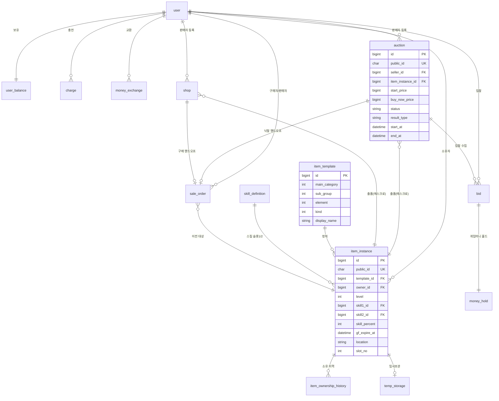

# FinalCall ERD (데이터 모델)

상태: v1.5 — G2 통과 (2026-07-13). 이후 D-070·B-012·D-073·**D-081**(soft delete 자연키 UK 생성 컬럼 패턴)·**게이트2 money_exchange 멱등 앵커**(SEC-004)·**게이트2 아이템 코드 축 배정 교정**(FC-044)·**게이트2 EPIC-CLOSING 정산 스키마**(FC-081 — sale_order NOT NULL·fee_policy_version·source UK·platform_revenue_ledger)·**게이트2 EPIC-PURCHASE**(FC-088 — 즉시구매+거래내역, **스키마 무변경**·semantic만)·**게이트2 EPIC-OAUTH**(FC-152 — user_social_account 신설·user.password_hash·login_id nullable화, V19) 반영. [6] 채번은 백엔드 실물 동기화분. api-contract(G3) 확정 → 구현 단계(G4-n). 스키마 변경은 domain-spec 정합 + 총괄 승인 경유.
소유: 기획/설계
근거: domain-spec v0.5, D-036(형식 골격), D-044~047·D-062·D-066(아이템), D-050~053(사용자·화폐), D-005·D-008(경매), **D-081**(soft delete 자연키 UK 패턴), B-001~009(기술 규약)
형식: D-036 — 네이밍 선언부 / Mermaid erDiagram / 테이블 정의 표 / 인덱스 표(이유 열) / Flyway 매핑

| 버전 | 날짜 | 내용 |
|---|---|---|
| v0 | 2026-07-13 | 골격 착수 — 네이밍 선언부·엔티티 개요·Mermaid |
| v0.1 | 2026-07-13 | 테이블 정의(§4, 14개)·인덱스 표(§5)·Flyway(§6) 작성. 네이밍(auction/shop/sale_order)·위치 디스크리미네이터 확정. G2 검수 대기 |
| v0.2 | 2026-07-13 | G2 통과. D-067 반영 — 시드 '가상' 제약 해제(원게임 실제 데이터·코드), skill_code 원게임 대응 정식화. G2 관찰: shop(item_instance_id) 인덱스 추가 |
| v0.3 | 2026-07-14 | 보안 델타(계약 v0.2) 정합 — charge.pg_tx_id UK(멱등 앵커, SEC-001), item_template.type_code 외부 식별자 UK(035) |
| v0.4 | 2026-07-14 | §6 Flyway 매핑 6절 정정(B-012) — 스켈레톤 V1·V2 소비 반영, 도메인은 V3부터. erd는 그룹·순서만 규정, 구체 채번은 백엔드 동기화 |
| v0.5 | 2026-07-14 | D-073 반영 — item_template.grade 제거, 유니크 (main_category,sub_group,element,kind), §5 인덱스 (element,kind), Mermaid 정정 |
| v0.7 | 2026-07-14 | [6] Flyway 채번 동기화(B-012 방식 b) — 백엔드 V4 실물(`V4__user_natural_key_uk.sql`, backend/033) 등재. 부수: v0.6 편집 시 [4] 말미 주가 `temp_storage` 표 선언과 컬럼 표 사이에 삽입돼 표가 분리됐던 구조 오류 복구(원인 = bash 마운트 뷰가 [5]·[6]을 서빙하지 않아 문서 말미로 오판. 호스트 Read로 발견·정정) |
| v0.6 | 2026-07-14 | D-081 반영(074) — [1] soft delete 자연키 UK 구현 지침 명문화(생성 컬럼 패턴 + 기각 해석 2종 + 동반 필수 + 대리키 예외 + 트리거 조건), [4.1] `user` 표에 `login_id_active`·`nickname_active` 생성 컬럼 UK 반영(원본 컬럼 존치), [4] 말미에 자연키 스윕 결과 주 신설(적용 대상 user 1건·그 외 0건·조건부 리스크 3건). 사유: 기존 [1] 한 줄이 의도만 말하고 구현 해석을 열어둬 V3가 함정을 밟음(backend/028 발견, QA-001) |
| v0.8 | 2026-07-17 | 게이트2 승인 반영 — [4.1] `money_exchange` 표에 `idempotency_key VARCHAR NOT NULL` + `(user_id, idempotency_key)` 복합 UK(멱등 앵커) 신설, [5] 정합성 인덱스·제약 절에 동 복합 UK 등재. 사유: 교환 멱등 DB 강제(SEC-004). 클라이언트 공급 키라 전역 아닌 사용자 스코프 복합 UK — charge.pg_tx_id(SEC-001) 선례 동류. 부수: applied_rate precision/scale 구현(V5) 확정 비고 1줄 |
| v0.9 | 2026-07-18 | 게이트2(FC-019, EPIC-ITEM) 승인 반영 — [4.3] `item_instance`에 slot 유일성 생성 컬럼 UK(`slot_key` GENERATED, `uk_item_instance_slot`) 신설(G2, D-081 선례 응용), 불변식에 DB 강제 근거 추가. [5] `temp_storage` 인덱스를 `(owner_id)` → `(owner_id, stored_at, instance_id)`로 보강(G3, cursor 안정 정렬). [5] `item_instance (template_id, level, skill1_id, skill2_id)` 인덱스 이유에 market-prices(§4.1) 집계 = EPIC-ITEM 제외·이연 주석. 사유: FC-019 계약 검증 갭 G2·G3 해소 + market-prices 이연(sale_order 데이터 선행). 진입 경로는 시드-only 확정(관리자 지급 API 미도입 → 계약·스키마 무추가). 근거: 게이트2 승인(2026-07-18) |

| v1.0 | 2026-07-18 | 게이트2(FC-030, EPIC-BID) 승인 반영 — **F1** [4.2] `bid`에 `public_id ULID NOT NULL UK` 추가(외부 노출 식별자 [1]·B-004 규약 이행. api-contract §3.1 입찰 응답 `bidPublicId`·§3.3 `BidSummary`가 요구하는데 표에 없어 계약을 만족하는 구현이 불가능했다 — bid-domain-spec §11 G1 발견). **F6** [5] `auction (status, highest_bid_amount)` 인덱스 신설(계약 §3.3 목록 정렬 화이트리스트 `highestBidAmount`가 EPIC-BID에서 실사용 시작 — auction-domain-spec §7 G5 이연분 해소). 부수: [5] `bid (auction_id, amount DESC)` 이유 열에 "현재 최고 입찰 식별 커버·`(auction_id, status)` 불요" 근거 명시(bid-domain-spec §11 G4). [6] Flyway group 2·4에 V11 실물 채번 동기화. 근거: 게이트2 승인(2026-07-18), bid-domain-spec v0.2 |

| v1.8 | 2026-08-06 | EPIC-BOARD(FC-196) — 커스텀 게시판 시스템 스키마. **게이트2 3건 사용자 승인 확정(2026-08-06).** **[2] 엔티티 개요·[4.5] `board`·`post`·`comment`·`post_image` 4테이블 신설**: `board`(레지스트리 — slug UK 자연키·no public_id·is_active 비활성토글 삭제·write_policy ADMIN_ONLY/AUTHENTICATED·allow_comments·board_type GENERAL/NOTICE/EVENT, soft delete 미도입 → D-081 무관), `post`(public_id·board FK·author_id nullable+닉 스냅샷·title/content·view_count/comment_count 비정규화·is_pinned·soft delete), `comment`(public_id·post FK·author 귀속·parent_comment_id 예약·soft delete), `post_image`(public_id·post_id nullable 고아·uploader FK·storage_key=오브젝트 스토리지 object key — 2단계 업로드). [5] 인덱스 5종(`post (board_id,is_deleted,is_pinned,id)`·`post (author_id)`·`comment (post_id,is_deleted,id)`·`post_image (post_id,sort_order)`·`post_image (uploader_id,created_at)` 고아정리). [6] Flyway 신규 group 7(커뮤니티 게시판)에 **V22**(board+post+comment+post_image+인덱스+시드)·**V23**(공지 이관+notice 유예 DROP) 예약(현재 최신 V21). **공지(notice) 흡수** — 활성 notice 행 → post(공지 게시판) 이관(author_id NULL·닉 '공지사항' 스냅샷·URGENT→is_pinned), notice 도메인·NoticeType·NoticeErrorCode 제거·CLAUDE.md §1 참조구현 bullet→board 갱신(§8, FC-201). **게이트2 3건 확정**: (a) 이미지 저장 = **오브젝트 스토리지(MinIO 로컬·S3 운영)** + StoragePort(S3 호환 단일 구현)·비공개 버킷 presigned GET 서빙 (b) 공지 흡수·notice 제거·board 참조구현 승계 (c) 옵션 모델 표준 3축. **마이그레이션·MinIO 인프라 실물 미작성**(FC-197·200·201 backend-impl 소유). 정본 = `board-domain-spec.md` v1.0 · api-contract §6. |
| v1.7 | 2026-08-05 | EPIC-ITEM-DELIVERY(FC-185) — 게임 아이템 지급 우편함 스키마. **[2] 엔티티 개요·[4.4] `item_delivery` 테이블 신설**(finalcall-native 내구 우편함: sale_order 1:1 UK·item_instance/recipient FK·item_uuid char40 멱등키 UK·자족 스냅샷 type_code/level/skill1_code/skill2_code/skill_percent/gf_expire_at·status PENDING/CLAIMED/APPLIED/DEFERRED/FAILED·claim_token 리스·append 원장 updated_at 없음). **[4.3] `item_instance.location`에 `IN_GAME` 값 추가**(게임 이관 완료 — 배송 APPLIED 시 전이, 재판매 차단 XOR 연장) + 불변식에 IN_GAME 행. [5] 인덱스 2종(`(status, created_at)` poller·리스 재청구·`(recipient_user_id, status)` 접속 claim·배송 상태 조회). [6] Flyway 신규 group 6(게임 연동·배송)에 **V21**(현재 최신 V20) 채번 등재. **게이트2 형상 3건(FC-185)**: (a) 이관 상태 = location enum 확장 `IN_GAME`(별도 상태축 기각) (b) 게임 claim = DB 직접 프로토콜(웹 REST 아님) (c) sale_order_id 1:1 UK가 낙찰·즉시구매 양 경로 커버(SettlementRecorder 공통 꼬리). **마이그레이션 실물은 미작성**(FC-186 backend-impl 소유). 정본 = `delivery-domain-spec.md` v1.0 · api-contract §4.6. |
| v1.6 | 2026-08-01 | EPIC-MEMO(FC-170) — 회원 간 메모(쪽지) 스키마. **[4.1] `user_memo` 테이블 신설**(게임 `new_sp.user_memo` 계승: sender/receiver = user FK + 닉 스냅샷 정규화 R1·`memo_type` 원 코드값 보존·`memo_level_gender` 분해 저장(sender_level/gender)·`body VARCHAR(120)` 용량 계승·is_read/is_deleted). [5] 인덱스 2종(받은함·보낸함 커서 `(*_id, is_deleted, id DESC)`). [6] Flyway group1-c에 **V20**(현재 최신 V19) 채번 등재. **게이트2 4결정 사용자 승인 확정(2026-08-01)**: (a) 레벨·성별 = 스냅샷 2컬럼·현재 기본값 Lv.1·성별 0(남) (b) 깔끔 원문 저장·게임 boundary에서만 28바이트 패딩 (c) `user_memo` 신규·V20·이름 유지 (d) 발신 자유 텍스트 + 게임 boundary 28바이트 자동 줄바꿈. 정본 = api-contract §2.6(v1.20)·memo-domain-spec v1.0 |
| v1.5 | 2026-07-29 | 게이트2(EPIC-OAUTH, FC-152) 승인 반영 — 소셜 로그인(방식 B) 스키마 확정. **[4.1] `user_social_account` 테이블 신설**(id·user_id FK·provider·provider_user_id·created_at, **UK(provider, provider_user_id)** — 소셜 신원 1:1·중복가입 차단·find-or-create 앵커). **[4.1] `user.password_hash`·`login_id` 널 N→Y**(소셜 전용 계정은 둘 다 NULL — 비밀번호 로그인 불가·신원=소셜). 소셜 프로필 이메일 **미저장**(결정 2 — user.email NULL 유지·별도 컬럼 없음 → email_active UK 무충돌). [5] 정합성 제약·[6] Flyway group1에 **V19**(현재 최신 V18) 채번 등재. 정본 = api-contract §2 소셜 로그인 |
| v1.4 | 2026-07-22 | 게이트2(EPIC-PURCHASE, FC-088) 승인 반영 — 즉시구매(BUYNOW)+거래내역 조회. **스키마 무변경**(신규 테이블·컬럼·마이그레이션·UK 없음). [4.2] `sale_order` 표 아래 승인 반영 주 추가 — semantic 델타만: `auction.result_type=BUYNOW`(종전 정의됨·미사용)가 즉시구매 SOLD 전이에서 **실사용 시작**(마감 SOLD=`BID`), `sale_order (buyer_id)`·`(seller_id)` 인덱스가 거래내역 role 스코프 조회에서 **실사용 시작**. `source_type=AUCTION`·`buy_now_price` 재사용, V14 그대로. 정본 = `purchase-spec.md` v1.0 |
| v1.3 | 2026-07-21 | 게이트2(EPIC-CLOSING, FC-081) 승인 반영 — 마감·낙찰 정산 코어 스키마 확정. **[4.2] `sale_order`**: `fee_amount` **널→NOT NULL**(SOLD에서만 생성), **`fee_policy_version VARCHAR(10) NOT NULL` 신설**(정책 버전 스냅샷·환불 재현), `(source_type,source_id)` **UK 승격**(이중 SOLD 차단). **`platform_revenue_ledger` 테이블 신설**(게이트2 #4=④-C — 수수료 전용 수익 원장, 정산 1:1 sale_order_id UK, 게임머니 총량 보존 I-H). [2] 엔티티 개요·[5] 인덱스·[6] Flyway(V14) 동기화. `sale_order`는 이 V14에서 최초 생성(종전 group4 이연분). 마감 워커 스캔은 기존 `auction (status, end_at)` 커버 — 신규 인덱스 불요. 근거: 게이트2 승인(2026-07-21), closing-domain-spec v1.0 |
| v1.2 | 2026-07-20 | 게이트2(EPIC-CLOSING) 승인 반영 — [4.2] `sale_order.fee_amount` 설명을 **"정책 ON-HOLD 자리만" → 정책 확정**으로 갱신(판매자 단독 부담, 산식·구간·최소/cap 정본 = 신규 `fee-policy-spec.md`, 값 범위 [100 G, 300,000 G]). 문서 머리 확정 줄의 ON-HOLD 목록에서 "플랫폼 수수료"를 해소 표기. **스키마 무변경**(fee_amount/settle_amount 컬럼·타입·널 그대로). 근거: 게이트2 승인(2026-07-20), fee-policy-spec v1.0 |
| v1.1 | 2026-07-19 | 게이트2(FC-044) 승인 반영 — [4.3] `item_template` **코드 축 배정 교정**: `main_category`=상품군(아이템 카드 `1` 고정)·`sub_group`=대분류(무기/방어구/마법). 종전 서술은 두 선두 자리 의미가 뒤바뀐 오배정이라 시드 `2111`이 원게임 SILVER 대역을 침범했다. 교정 후 `type_code`가 원게임 `itm_type`과 **1:1 동일**해진다. 아울러 `kind` 설명의 **평면 나열("검·도·활·방·펜…")을 폐기** — `kind`는 의미가 `sub_group`에 의존하고 마법은 2값뿐(3·4 부재)인데 종전 서술이 이를 감췄다. `type_code` 산식·스코프(상품군 1 한정)·시드 정합 부채를 표 아래 주로 명기. **스키마 무변경**(컬럼·타입·UK·인덱스 전부 그대로) — 교정 대상은 서술과 시드 데이터뿐이다. 근거: 게이트2 승인(2026-07-19), 제안서 `spec/proposals/item-code-dictionary.md` v2. 코드값 열거 정본은 api-contract §3.3.1 |

확정: 플래그 A(order명 `sale_order`)·B(위치 디스크리미네이터) 모두 확정(1절·2절). G2 통과(2026-07-13). **플랫폼 수수료 정책 = 해소**(종전 ON-HOLD → 게이트2 확정 2026-07-20, 정본 `fee-policy-spec.md`, `sale_order.fee_amount`/`settle_amount`). 남은 미확정 — 캐시↔게임머니 교환비율(ON-HOLD), 아이템 시드 멤버·명칭·수치(원게임 데이터, 시드 단계, D-067).

> **⚠ PROPOSAL — EPIC-SHOP(FC-092), 게이트2 미승인 (2026-07-22). 승인 전까지 확정 아님.** 정본 = `shop-spec.md` v1.0.
> **스키마 컬럼·인덱스 무변경** — `shop` 테이블은 §4.2에, 인덱스는 §5에 **이미 정의**돼 있다. 델타는 채번·semantic뿐:
> - Flyway §6 group4에 **`V15__shop.sql`** 실물 채번(현재 최신 V14) — `shop` 테이블 최초 생성(§4.2 정의 준수) + 인덱스 `(status,end_at)`·`(seller_id,status)`·`(item_instance_id)`. `price>0`은 앱 검증(auction 선례, DB 체크 제약 미도입).
> - `end_at` **nullable 유지(컬럼 변경 없음)**. 등록 시 서버가 `end_at = now + shop.listing.default-duration-days`(관리자 설정, 기본 7일)로 **자동 계산**해 채운다(판매자 미선택 — 게이트2 정정 2026-07-22). NULL(무기한, 만료 워커 `end_at IS NOT NULL` 스캔 제외)은 **향후 "무기한 노출 캐시아이템"** 전용이며 이 에픽 범위 밖이다. 유한 기한은 만료 시 EXPIRED + 아이템 TEMP 직행 회수(shop-spec §4.4).
> - semantic: `sale_order.source_type=SHOP` · `uk_sale_order_source(source_type,source_id)`가 고정가 SOLD 핸드오프에서 **실사용 시작**(종전 정의됨·AUCTION만 기록). 복합 UK라 SHOP/AUCTION의 source_id 수치가 같아도 충돌 없음. `(buyer_id)`·`(seller_id)` 인덱스가 SHOP 거래내역 조회에서 실사용.
> - 승인 시 반영: 버전 로그 v1.5 "게이트2(EPIC-SHOP) 승인 — shop 테이블 V15 최초 생성, SHOP source_type 실사용. 스키마 컬럼·인덱스 무변경."

---

## 1. 네이밍 규칙 선언부 (B-001~004)

백엔드 확정 기술 규약을 ERD 표기 기준으로 선언한다. 이 규칙이 전 테이블에 적용된다.

- 테이블: 단수 + snake_case (JPA 자동 변환 전제). 예: `user`, `auction`, `item_instance`.
- PK: `id BIGINT AUTO_INCREMENT`, 단일 대리키. 자연키는 PK로 쓰지 않고 유니크 제약으로 표현.
- FK: `<참조테이블>_id` (역할 접두 허용, 예: `seller_id`, `buyer_id`). 물리 FK로 시작.
- 외부 노출 식별자: `public_id`(ULID, char/varchar). 외부 노출 리소스(user·auction·shop·item_instance 등)에 부여. 내부 조인·FK는 `id`.
- 시간: `DATETIME(6)` UTC 저장, 컬럼 접미 `_at`. (Instant/UTC — CLAUDE.md 정합)
- soft delete: `is_deleted`(bool) + `deleted_at`. soft delete 테이블의 자연키 유니크는 삭제 식별 컬럼을 포함(삭제행-신규행 충돌 회피).
- **soft delete 자연키 유니크 = 생성 컬럼 패턴 (D-081 확정 · 구현 지침)**

  위 한 줄은 의도만 말하고 구현 해석을 열어둬 함정을 허용했다(V3 `user`가 실제로 밟았다 — backend/028, QA-001). 아래가 확정 구현이다.

  ```sql
  <자연키>_active <TYPE> GENERATED ALWAYS AS (IF(is_deleted, NULL, <자연키>)) STORED,
  UNIQUE KEY uk_<table>_<자연키>_active (<자연키>_active)
  ```
  활성 행만 값을 가져 유일성이 보존되고, 삭제행은 NULL이라 MySQL 다중 NULL 허용으로 재삭제가 무제한이다. 원본 컬럼은 존치하고 UK만 생성 컬럼에 건다. `deleted_at`은 널 허용을 유지한다.

  - **기각된 해석 — 규약의 문자를 지키면서 의도를 깨는 함정이라 반드시 피한다**
    - `UNIQUE(<자연키>, deleted_at)` — **활성 중복이 조용히 뚫린다.** MySQL은 UNIQUE에서 NULL을 서로 다른 값으로 취급하므로 `deleted_at IS NULL`인 활성 행이 동일 자연키로 N개 허용된다. 위 한 줄("삭제 식별 컬럼을 포함")을 문자 그대로 만족시키면서 유일성을 파괴하므로 **가장 위험하다.**
    - `UNIQUE(<자연키>, is_deleted)` — 삭제행이 자연키당 1개로 제한돼 재삭제(재가입 후 재탈퇴)에서 충돌한다. domain-spec [6.1] 이력 보존과 상충한다.
  - **동반 필수** — UK만 고치면 파손된다. 재사용이 허용되면 동일 자연키에 삭제행과 활성행이 공존하므로, 단건 조회 파생 쿼리에 활성 필터(`...AndIsDeletedFalse`)를 함께 넣어야 한다. 누락 시 다건 반환으로 단건 바인딩이 깨진다(로그인 파손).
  - **적용 대상 = 자연키만.** `public_id`(ULID) 같은 시스템 발급 대리 식별자는 재사용되지 않아 삭제행-신규행 충돌이 성립하지 않는다 — 패턴 불요.
  - **트리거 조건** — 자연키 UK를 가진 테이블에 soft delete를 **새로 도입하는 순간** 이 패턴이 의무가 된다. 현재 해당 테이블은 `user` 하나이며, 자연키 UK를 갖되 soft delete가 없어 아직 무관한 테이블은 [4] 표 말미 주를 참조한다.
  - 근거: D-081(정본) · backend/028(발견) · QA-001 · 074.
- 상태 enum: 대문자 문자열(예: `SCHEDULED`,`ACTIVE`,`SOLD`).

테이블 네이밍 확정(2026-07-13, 사용자): 경매 = `auction`, 고정가 = `shop`(별도 구조 유지, P-001 불변). 도메인 용어 "경매(Auction)/고정가(FixedSale)"는 domain-spec 유지, 물리 테이블만 매핑(auction / shop).

Order 테이블명 확정(2026-07-13, 사용자): `sale_order`. 판매 성립(SOLD) 거래 레코드로 경매 낙찰 + shop 구매 공통 핸드오프(§5 구매 경로 단일화). 접두어(tb_) 미도입 — B-001 단수 규칙 유지, 예약어 `order`는 단수 합성어 `sale_order`로 회피(규칙 예외 불요).

---

## 2. 엔티티 개요

도메인별 엔티티. 상세 컬럼은 4절 테이블 표, 관계는 3절 Mermaid.

거래 주체·화폐 (D-050~053)
- `user` — 단일 사용자. 관리자 = 권한 플래그. 로그인 식별.
- `user_balance` — 사용자별 잔액: 캐시 / 게임머니 (1:1).
- `charge` — 캐시 충전(토스 테스트 결제). 별도 도메인, 콜백 검증·멱등키.
- `money_exchange` — 캐시↔게임머니 교환 이력(교환 비율 파라미터, ON-HOLD).
- `money_hold` — 입찰 시 게임머니 홀드(에스크로). 입찰 1건 대응.

판매·거래 (P-001, D-005, D-008)
- `auction` — 영국식 경매(+즉시구매 선택). item_instance 1건 보유(에스크로).
- `bid` — 경매 입찰. money_hold 연계.
- `shop` — 고정가 판매(domain-spec 용어 FixedSale/고정가 ↔ 테이블 shop). item_instance 1건 보유(에스크로).
- `sale_order` — 판매 성립(SOLD) 시 생성되는 거래(결제·정산·소유 이전). 경매·고정가 공통 핸드오프.
- `platform_revenue_ledger` — 사업자 수익 원장(EPIC-CLOSING, v1.3). SOLD 정산 1건당 수수료 1행 적립(append-only). 게임머니 총량 보존의 회계 축.
- `item_delivery` — 게임 아이템 지급 우편함(EPIC-ITEM-DELIVERY, v1.7). SOLD/BUYNOW 정산 1건당 배송 1행(sale_order 1:1). finalcall-native 내구 정본(웹→게임 인벤토리 다리), 자족 스냅샷·item_uuid 멱등키. 게임이 DB 직접 claim(§4.4·delivery-domain-spec).

커뮤니티·콘텐츠 (EPIC-BOARD, v1.8 — 게이트2 승인 확정)
- `board` — 게시판 레지스트리(§4.5). slug 자연키·is_active 비활성토글·write_policy·allow_comments·board_type. 하드코딩 enum(구 `NoticeType`) 대체 — 코드 수정 없이 게시판 추가·변경. 시드 3건(공지·커뮤니티·이벤트).
- `post` — 게시글. board 귀속·작성자 귀속·soft delete·이미지 첨부·조회수/댓글수 비정규화·상단 고정. 기존 `notice`를 흡수(§8 board-spec).
- `comment` — 게시글 댓글. post 귀속·작성자 귀속·soft delete·대댓글 컬럼 예약.
- `post_image` — 게시글 이미지 첨부. 2단계 업로드(고아→바인딩). 파일 실체는 오브젝트 스토리지(MinIO 로컬·S3 운영), 표는 메타·object key만 보유.

아이템 (D-044~047·D-062·D-066)
- `item_template` — 아이템 정의 마스터. 타입코드 정규화(상품군·대분류·속성·종류) + 표시명(원게임 시드). 등급 축 없음(D-073). 코드값 정본은 api-contract §3.3.1.
- `skill_definition` — 특수스킬 정의 마스터(가상 시드). 인스턴스 스킬 슬롯이 참조.
- `item_instance` — 개별 아이템. template FK + 레벨·스킬 2슬롯·발동확률·골드포스 + 소유자 + 위치.
- `item_ownership_history` — 소유 이전 이력(최초·직전·전체 체인). 비거래 이전도 통합.
- `temp_storage` — 임시보관(오버플로우). 상한 없음. 보관 기한(선택).

결정 플래그 B (위치 단일진실 — 확정 2026-07-13, 사용자): `item_instance.location`(enum INVENTORY/TEMP/LISTED) 단일 디스크리미네이터. INVENTORY일 때만 `slot_no`(0~95), TEMP일 때 `temp_storage` 행 존재, LISTED일 때 활성 리스팅(auction/shop)이 참조. XOR 불변식은 앱 + DB 제약으로 강제.

---

## 3. Mermaid erDiagram (골격)

관계와 핵심 키만 표기. 전체 컬럼은 4절 표.



주: 위 Mermaid는 골격이다. money_hold·sale_order·정산 상세, 소프트 클로즈 연장 컬럼, 화폐 잔액 컬럼 등은 4절 테이블 표에서 확정한다.

---

## 4. 테이블 정의 표

공통 컬럼(모든 테이블): `id BIGINT PK AUTO_INCREMENT`, `created_at DATETIME(6)`. 갱신 대상은 `updated_at`.
아래 표는 도메인 고유 컬럼 위주로 적고 공통 컬럼은 생략한다. 타입은 논리 타입(백엔드 구현 시 확정).

### 4.1 사용자·화폐/홀드 (D-050~053)

table `user` — 단일 사용자(관리자=플래그). 인증 상세 필드는 api-contract auth 섹션에서 확정(D-002).

| 컬럼 | 타입 | 널 | 키 | 설명 |
|---|---|---|---|---|
| public_id | ULID | N | UK | 외부 노출 식별자(B-004). 대리 식별자라 D-081 패턴 불요 |
| login_id | VARCHAR(50) | Y | | 로그인 식별자(자연키). **원본에 UK를 걸지 않는다** — D-081. **소셜 전용 계정은 NULL**(신원=소셜, EPIC-OAUTH V19) |
| login_id_active | VARCHAR(50) | Y | UK | 생성 컬럼 `GENERATED ALWAYS AS (IF(is_deleted, NULL, login_id)) STORED`. 활성만 유일·삭제행/소셜계정(login_id NULL) NULL(D-081) |
| password_hash | VARCHAR | Y | | 비밀번호 해시. **소셜 전용 계정은 NULL**(비밀번호 로그인 불가 — 소셜 계정 비번 로그인 시도는 `AUTH_003`, EPIC-OAUTH V19) |
| nickname | VARCHAR(30) | N | | 표시명(자연키). **원본에 UK를 걸지 않는다** — D-081 |
| nickname_active | VARCHAR(30) | Y | UK | 생성 컬럼 `GENERATED ALWAYS AS (IF(is_deleted, NULL, nickname)) STORED` (D-081) |
| is_admin | BOOLEAN | N | | 관리자 권한 플래그(기본 false) |
| is_deleted | BOOLEAN | N | | soft delete |
| deleted_at | DATETIME(6) | Y | | 널 허용 유지 |

`user` 주(D-081):
- 이 UK 구성에 **재가입 허용**(api-contract [2.5] · domain-spec [6.1])이 의존한다. 원본 컬럼에 단일 UK를 걸면 재가입이 동작하지 않는다 — V3가 그 상태였고 V4에서 재구성한다(채번은 백엔드 동기화, [6]).
- **동반 필수**: `UserRepository` 단건·존재 조회는 활성 필터를 함께 건다(`findByLoginIdAndIsDeletedFalse` 등). UK만 고치면 삭제행+활성행 다건 반환으로 로그인이 깨진다.
- 컬럼 길이(`login_id` 50 · `nickname` 30)는 V3 실물 기준이며 생성 컬럼은 원본과 동일 타입·길이를 쓴다.

`user` 주(EPIC-OAUTH, v1.5 — 소셜 로그인 방식 B):
- **`login_id`·`password_hash` NOT NULL 해제**: 소셜 전용 계정은 loginId·비밀번호가 없다(신원 = `user_social_account`의 provider+provider_user_id). 생성 컬럼 `login_id_active`(`IF(is_deleted, NULL, login_id)`)는 NULL을 UK에서 제외하므로 **생성 컬럼·UK 정의 변경 불요**(원본 컬럼 nullable화만). 비밀번호 로그인(§2 `/login`)은 소셜 계정(password_hash NULL)에 대해 자격 불일치(`AUTH_003`)로 처리 — 계정 존재 비노출(SEC-007).
- 소셜 프로필 **이메일 미저장**(결정 2): `user.email` NULL 유지, `user_social_account`에도 email 컬럼을 두지 않는다 → `email_active` UK(활성 유니크)와 무충돌. `user.email`은 §2 `PUT /me/email`로만 채워지는 자기 소유·검증 채널.

table `user_social_account` — 소셜 신원 연결(EPIC-OAUTH, 방식 B). 한 user가 provider별 소셜 신원을 갖는다. 신원 키 = (provider, provider_user_id)이며 이메일은 신원이 아니다(결정 2).

| 컬럼 | 타입 | 널 | 키 | 설명 |
|---|---|---|---|---|
| id | BIGINT | N | PK | 내부 식별자(외부 미노출) |
| user_id | BIGINT | N | FK→user | 연결 회원 |
| provider | VARCHAR(20) | N | UK(복합) | 소셜 provider — 대문자 `NAVER` \| `KAKAO` |
| provider_user_id | VARCHAR(255) | N | UK(복합) | provider의 안정적 사용자 식별자(naver=문자열 해시·kakao=숫자 문자열) |
| created_at | DATETIME(6) | N | | 최초 연결(자동가입) 시각 |

유니크: **(provider, provider_user_id) 복합 UK** — 하나의 소셜 신원이 정확히 한 user에 매핑(find-or-create 조회·중복가입 방지 앵커). `user_id`는 FK 인덱스로 역참조(한 user의 연결 목록). `public_id` 불요(외부 미노출 내부 연결 테이블). soft delete 미보유(연결 회수는 이 에픽 범위 밖). **선택(향후)**: 계정 연결 플로 도입 시 한 user가 동일 provider 이중 연결을 막는 `(user_id, provider)` UK를 검토(현재 find-or-create만이라 불요).

table `user_memo` — 회원 간 메모(쪽지). 게임 원본 `new_sp.user_memo` 계승 네이티브 도메인(EPIC-MEMO, **v1.6 확정·게이트2 승인 2026-08-01**). feature `com.finalcall.domain.memo`, 엔티티 `Memo`. 정본 = `memo-domain-spec.md` v1.0.

| 컬럼 | 타입 | 널 | 키 | 설명 |
|---|---|---|---|---|
| public_id | ULID | N | UK | 외부 노출 식별자(B-004). 상세·삭제 경로 리소스. 대리키라 D-081 패턴 불요 |
| sender_id | BIGINT | Y | FK→user | 발신 회원. 시스템 메모(게임 발신)·임포트 미매칭은 NULL. 웹 유저 발신은 항상 값 |
| sender_nickname | VARCHAR(16) | N | | 발신 시점 닉 스냅샷(게임 `char(16)` 계약·닉 변경 대비 R1) |
| sender_level | INT | Y | | 발신자 레벨 스냅샷(게임 boundary가 `level×100+gender` 재합성). **웹 발신 소스(확정 게이트2 a) = 기본값 1**(user 게임레벨 부재, 향후 실값 교체). 시스템 메모·임포트는 NULL |
| sender_gender | TINYINT | Y | | 발신자 성별 스냅샷(0/1). **웹 발신 소스(확정 게이트2 a) = 기본값 0(남)**(user 성별 부재, 향후 실값 교체). 시스템 메모·임포트는 NULL |
| receiver_id | BIGINT | Y | FK→user | 수신 회원. 웹 발신은 항상 값(닉→id 정규화). 임포트 미매칭 대비 NULL 허용 |
| receiver_nickname | VARCHAR(16) | N | | 수신 시점 닉 스냅샷 |
| memo_type | INT | N | | 게임 코드값 **원형 보존**(5=USER·0/14=SYSTEM). 문자열 enum 변환 금지(게임 클라 int 읽기) |
| body | VARCHAR(120) | N | | 본문(게임 `char(120)` 용량 계승). 순수 텍스트 저장·28바이트 고정폭은 boundary(spec §8) |
| is_read | BOOLEAN | N | | 열람 여부(게임 `memo_state` 0/1). 기본 false |
| read_at | DATETIME(6) | Y | | 최초 열람 시각 |
| is_deleted | BOOLEAN | N | | soft delete(게임 `memo_del`). 기본 false. **단일 플래그 — 한쪽 삭제가 양쪽 반영**(게임 계약) |
| deleted_at | DATETIME(6) | Y | | |

주: `updated_at` 미도입(본문 불변·상태 단방향 전이, `BaseCreatedEntity` 계열 — item_ownership_history 선례). `created_at`=발신 시각(게임 `add_date`). soft delete 자연키 UK 패턴(D-081) 불요(닉 컬럼은 스냅샷이지 UK 아님, public_id는 대리키). `*_id` nullable = 시스템 메모·레거시 임포트 미매칭 수용(finalcall 웹 발신은 항상 채움).

table `user_balance` — 사용자별 잔액(1:1). 잔액 갱신은 원자적(D-008).

| 컬럼 | 타입 | 널 | 키 | 설명 |
|---|---|---|---|---|
| user_id | BIGINT | N | UK, FK→user | 1:1 |
| cash_balance | BIGINT | N | | 캐시 잔액(충전 화폐) |
| game_money_balance | BIGINT | N | | 게임머니 잔액(거래 화폐) |
| game_money_held | BIGINT | N | | 홀드 합계(가용 = balance − held) |

table `charge` — 캐시 충전(토스 테스트 결제). 별도 도메인, 거래 TX와 분리(D-051·D-053).

| 컬럼 | 타입 | 널 | 키 | 설명 |
|---|---|---|---|---|
| public_id | ULID | N | UK | |
| user_id | BIGINT | N | FK→user | |
| amount | BIGINT | N | | 충전 캐시액 |
| status | ENUM | N | | READY / APPROVED / FAILED |
| idempotency_key | VARCHAR | Y | | 요청 재시도 편의 보조(멱등 앵커는 pg_tx_id, SEC-001) |
| pg_tx_id | VARCHAR | Y | UK | PG 승인 식별자(paymentKey) — 멱등 앵커. 동일 승인 재반영 DB 차단(SEC-001) |
| approved_at | DATETIME(6) | Y | | |

table `money_exchange` — 캐시↔게임머니 교환. 교환 비율은 파라미터(ON-HOLD, 추적표).

| 컬럼 | 타입 | 널 | 키 | 설명 |
|---|---|---|---|---|
| user_id | BIGINT | N | FK→user | |
| cash_amount | BIGINT | N | | 차감 캐시 |
| game_money_amount | BIGINT | N | | 지급 게임머니 |
| applied_rate | DECIMAL | N | | 적용 교환 비율(당시 파라미터 스냅샷). precision/scale은 구현(V5)에서 확정 |
| idempotency_key | VARCHAR | N | UK(복합) | 멱등 앵커 — 클라이언트 공급 키. 중복 교환 재실행 DB 차단(SEC-004) |

유니크: (user_id, idempotency_key) 복합 UK. 클라이언트 공급 키라 전역이 아니라 사용자 스코프(charge.pg_tx_id 멱등 앵커 선례 동류, SEC-004).

table `money_hold` — 입찰 시 게임머니 홀드(에스크로, D-052). 상위 입찰 시 즉시 해제(P-008), 낙찰 시 차감.

| 컬럼 | 타입 | 널 | 키 | 설명 |
|---|---|---|---|---|
| user_id | BIGINT | N | FK→user | 입찰자 |
| bid_id | BIGINT | N | UK, FK→bid | 홀드-입찰 1:1 |
| amount | BIGINT | N | | 홀드 게임머니 |
| status | ENUM | N | | HELD / RELEASED / CAPTURED |
| released_at | DATETIME(6) | Y | | 해제·차감 시각 |

### 4.2 경매·입찰·고정가·주문 (P-001, D-004·005·008, §5)

table `auction` — 영국식 경매(+즉시구매 선택). 종료 전이는 CAS 단일 승자(D-008). 소프트클로즈로 `end_at` 동적 갱신(D-004).

| 컬럼 | 타입 | 널 | 키 | 설명 |
|---|---|---|---|---|
| public_id | ULID | N | UK | |
| seller_id | BIGINT | N | FK→user | 판매자 |
| item_instance_id | BIGINT | N | FK→item_instance | 출품 아이템(에스크로) |
| start_price | BIGINT | N | | 시작가 |
| buy_now_price | BIGINT | Y | | 즉시구매가(선택, > start_price, P-002) |
| status | ENUM | N | | SCHEDULED/ACTIVE/SOLD/UNSOLD/CANCELLED |
| result_type | ENUM | Y | | BID/BUYNOW (SOLD일 때) |
| highest_bid_amount | BIGINT | Y | | 현재 최고가(비정규화, 빠른 조회) |
| highest_bidder_id | BIGINT | Y | FK→user | 현재 최고 입찰자 |
| start_at | DATETIME(6) | Y | | 예약 시작(SCHEDULED→ACTIVE 트리거) |
| end_at | DATETIME(6) | N | | 마감 시각(소프트클로즈로 갱신) |
| base_end_at | DATETIME(6) | N | | 최초 마감(연장 기준) |
| max_end_at | DATETIME(6) | N | | 총연장 상한 — 초과 연장 불가(D-004) |
| soft_close_window_sec | INT | N | | 트리거 윈도우(경매별 설정) |
| soft_close_extend_sec | INT | N | | 연장폭 |
| extension_count | INT | N | | 누적 연장 횟수 |
| item_name_snapshot | VARCHAR | N | | 등록 시점 표시명 스냅샷(D-045) |
| item_spec_snapshot | VARCHAR | N | | 등록 시점 핵심 스펙 요약 스냅샷 |

table `bid` — 경매 입찰(D-004). 자기·연속 입찰 금지는 앱 검증. 홀드는 `money_hold`가 참조.

| 컬럼 | 타입 | 널 | 키 | 설명 |
|---|---|---|---|---|
| public_id | ULID | N | UK | 외부 노출 식별자(B-004·[1]). api-contract §3.1 입찰 응답 `bidPublicId`·§3.3 `BidSummary`가 요구(v1.0, F1) |
| auction_id | BIGINT | N | FK→auction | |
| bidder_id | BIGINT | N | FK→user | 입찰자 |
| amount | BIGINT | N | | 입찰액(< buy_now_price, D-004) |
| status | ENUM | N | | ACTIVE/OUTBID/WON |

table `shop` — 고정가 판매(구매 = 원자적 선점 CAS, D-008). 도메인 용어 FixedSale/고정가.

| 컬럼 | 타입 | 널 | 키 | 설명 |
|---|---|---|---|---|
| public_id | ULID | N | UK | |
| seller_id | BIGINT | N | FK→user | 판매자 |
| item_instance_id | BIGINT | N | FK→item_instance | 출품 아이템(에스크로) |
| price | BIGINT | N | | 고정 판매가 |
| status | ENUM | N | | ACTIVE/SOLD/EXPIRED/CANCELLED |
| end_at | DATETIME(6) | Y | | 선택 판매 기한(만료 시 EXPIRED) |
| item_name_snapshot | VARCHAR | N | | 등록 시점 표시명 스냅샷(D-045) |
| item_spec_snapshot | VARCHAR | N | | 등록 시점 핵심 스펙 요약 스냅샷 |

table `sale_order` — 판매 성립 거래(경매 낙찰 + shop 구매 공통, §5). 정산·소유이전 단일 TX(D-053).

| 컬럼 | 타입 | 널 | 키 | 설명 |
|---|---|---|---|---|
| public_id | ULID | N | UK | |
| source_type | ENUM | N | | AUCTION / SHOP (출처 구분) |
| source_id | BIGINT | N | | 출처 리스팅 id(auction.id 또는 shop.id) |
| buyer_id | BIGINT | N | FK→user | 구매자 |
| seller_id | BIGINT | N | FK→user | 판매자 |
| item_instance_id | BIGINT | N | FK→item_instance | 이전 대상 |
| final_price | BIGINT | N | | 최종 낙찰가/구매가 |
| fee_amount | BIGINT | N | | 플랫폼 중계 수수료(**판매자 단독 부담**). 산식·구간표·최소/상한 정본 = **fee-policy-spec.md**(게이트2 확정 2026-07-20). 값 범위 [100 G, 300,000 G](최소 100·cap 300,000). **SOLD 성립분에만 생성되므로 NOT NULL**(v1.3 — 취소·유찰은 sale_order 미생성 → 수수료 없음. 종전 널 허용은 백엔드 동결 시 자리 잔존이었고, 실기록은 항상 값 존재라 EPIC-CLOSING에서 NOT NULL 확정) |
| settle_amount | BIGINT | N | | 판매자 정산액(= final_price − fee) |
| fee_policy_version | VARCHAR(10) | N | | 적용 수수료 정책 버전 스냅샷(예: `v1.0`, v1.3 신설). 정산 후 환불 비례 크레딧(fee-policy-spec §5)이 "당시 정책"을 재현. `platform_revenue_ledger`와 동일 값 |
| status | ENUM | N | | SETTLED (내부 DB 단일 TX) |
| settled_at | DATETIME(6) | N | | 정산 완료 시각 |

주: `source_type + source_id` 폴리모픽 참조(플래그 논의 채택 a). 물리 FK 제약이 약해지는 대신 채널 확장에 유연.

**EPIC-PURCHASE 게이트2 승인 반영(v1.4, 2026-07-22)**: 즉시구매(BUYNOW) + 거래내역 조회는 **스키마 변경이 없다** — `sale_order`의 `source_type=AUCTION`·`auction.result_type=BUYNOW`(정의됨·미사용)·`auction.buy_now_price`가 이미 존재하고 V14를 그대로 재사용한다. 델타는 **semantic뿐**: (1) `result_type` 값 `BUYNOW`가 즉시구매 SOLD 전이에서 **실사용 시작**(마감 SOLD는 `BID`, 즉시구매 SOLD는 `BUYNOW`), (2) `sale_order (buyer_id)`·`(seller_id)` 인덱스가 거래내역 조회(`GET /me/orders` role 스코프)에서 **실사용 시작**. 신규 테이블·컬럼·마이그레이션·UK **없음**. 정본 = `purchase-spec.md` v1.0 §1.1·§7.

**EPIC-CLOSING 게이트2 승인 반영(v1.3, 2026-07-21)**: `sale_order`는 현재 DB 미생성(§6 group4 "후속 에픽 V12+" 이연분)이며 EPIC-CLOSING 코어가 **`V14__sale_order_and_settlement.sql`**로 생성한다. 위 표에 반영된 델타 — `fee_amount` **NOT NULL**(SOLD에서만 생성되므로 항상 값 존재), `fee_policy_version VARCHAR(10) NOT NULL` **신규**(적용 정책 버전, 감사·환불 비례 크레딧 재현), `(source_type, source_id)` **UK 승격**(동일 경매 이중 SOLD 차단 = 이중 정산 방지, closing-domain-spec §6 I-C). 정본 = `closing-domain-spec.md` v1.0.

table `platform_revenue_ledger` — 사업자 수익 원장(EPIC-CLOSING, 게이트2 #4 = ④-C 확정). SOLD 정산 1건당 수수료(`fee_amount`)를 1행 적립하는 append-only 원장. "사업자 게임머니 총수익 = `SUM(amount)`"의 정본이며 게임머니 총량 보존(closing-domain-spec §6 I-H)의 회계 한 축이다. 플랫폼을 user로 두지 않아(거래 주체 오염 회피) 전용 원장으로 분리한다.

| 컬럼 | 타입 | 널 | 키 | 설명 |
|---|---|---|---|---|
| sale_order_id | BIGINT | N | UK, FK→sale_order | 정산 1:1. **UK가 수수료 이중 적립을 DB 차단**(I-C·I-H 연동) |
| amount | BIGINT | N | | 적립 수익 = 그 정산의 `sale_order.fee_amount`(계산기 1회 산출값) |
| fee_policy_version | VARCHAR(10) | N | | 적용 정책 버전 스냅샷(sale_order와 동일 값) |

주: `public_id` 없음(내부 회계 원장, 외부 노출 리소스 아님 — money_hold·money_exchange 선례). 불변 원장이라 `updated_at` 없음(`BaseCreatedEntity`, item_ownership_history 선례). 공통 컬럼 `id`·`created_at`(적립 시각)은 생략 규칙대로 표에서 뺐다.

### 4.3 아이템 (D-044~047·D-062·D-066)

table `item_template` — 아이템 정의 마스터. 타입코드 정규화(①). 고정 시드(Flyway). taxonomy 멤버 값·명칭은 원게임(SurvivalProject) 실제 데이터로 시드에서 확정(D-067).

**코드 축 정본 = api-contract §3.3.1(아이템 코드 사전).** 아래는 컬럼 정의이며, 코드값 열거는 계약이 소유한다.

| 컬럼 | 타입 | 널 | 키 | 설명 |
|---|---|---|---|---|
| main_category | INT | N | | **상품군** — 천의 자리. 아이템 카드 = `1` 고정(아래 스코프 주) |
| sub_group | INT | N | | **대분류** — 백의 자리. 1=무기·2=방어구·3=마법. **`kind`의 의미를 결정한다** |
| element | INT | N | | 속성 — 십의 자리. 1=물·2=불·3=흙·4=바람 |
| kind | INT | N | | 종류 — 일의 자리. **⚠ 의미가 `sub_group`에 의존한다**(평면 나열 불가 — 아래 주) |
| type_code | INT | N | UK | 자리값 합성 코드 — item_template 외부 식별자(035, public_id 미부여) |
| display_name | VARCHAR | N | | 표시명(원게임 데이터, 시드) |

```
type_code = main_category×1000 + sub_group×100 + element×10 + kind
```

유니크: (main_category, sub_group, element, kind) 조합 1건. (등급 축 제거, D-073)

**축 배정(v1.1, 게이트2 FC-044 승인)**: 위 산식은 원게임 `gameshop.itm_type`과 **자릿수·의미가 완전히 일치**한다 —
`type_code`와 `itm_type`은 1:1 동일하며 변환 계층이 없다. 종전 서술("main=대분류, sub=중분류/슬롯군")은
두 선두 자리의 의미가 뒤바뀐 오배정이었고, 그 결과 시드 `2111`(물의 방패)이 원게임 `2xxx`(SILVER 상품) 대역을
침범했다. v1.1에서 **`main_category`=상품군 · `sub_group`=대분류(무기/방어구/마법)**로 교정한다.

**⚠ `kind`를 평면 나열하지 말 것.** 같은 숫자가 `sub_group`마다 다른 것을 가리킨다 —
`kind=1`은 무기에서 도끼, 방어구에서 방패, 마법에서 일반이다. 또 **마법(`sub_group=3`)은 `kind`가 2값뿐**
(1=일반·2=특수)이고 3·4가 **존재하지 않는다**. 종전 설명 "종류(검·도·활·방·펜…)"는 이 의존성과
카디널리티 차이를 감췄다. 전 코드표는 계약 §3.3.1이 대분류별로 분리해 정의한다.

**스코프**: `item_template`은 **상품군 1(아이템 카드)만** 담는다. 원게임의 다른 상품군(2=SILVER,
3=골드포스 충전권, 4=아바타, 5=펫, 6=속성카드)은 거래 대상이 아니며, 이들은 위 4축 분해를 따르지 않는
평면 SKU 채번이라 **산식이 성립하지 않는다**(예: 속성카드 `6000~6003`은 속성이 일의 자리에 0-based).
따라서 현재 `main_category`는 실질 상수 `1`이다 — 자리를 비워두는 것이 아니라 **확장 경로가 정의된 축**이며,
편입 시 계약 변경 + 게이트2가 선행된다.

**⚠ 시드 정합 부채(2026-07-19)**: 현행 `V9__item_seed.sql`은 **교정 전 축 배정**으로 작성돼 있다
(`2111` 등 4건이 상품군 자리에 대분류를 넣었고, 표시명 6건이 원본 `kind` 정의와 어긋난다).
**스키마·산식·UK는 변경 없고 데이터만 교정 대상**이다. 시드 재작성은 백엔드 동결 해제 후 별도 티켓이며,
대조표는 `spec/proposals/item-code-dictionary.md` §3.3에 있다.

table `skill_definition` — 특수스킬 정의 마스터(②). 원게임(SurvivalProject) 스킬 데이터 시드. 인스턴스 슬롯1/2가 참조.

| 컬럼 | 타입 | 널 | 키 | 설명 |
|---|---|---|---|---|
| skill_code | INT | N | UK | 원게임 스킬 ID(100~435) |
| name | VARCHAR | N | | 스킬명(원게임 데이터, 시드) |
| description | VARCHAR | Y | | 설명 |

주: 슬롯1/2에 올 수 있는 유효 스킬 풀(장비 종류별 상이)은 시드·검증 규칙으로 관리(테이블 모델 밖).

table `item_instance` — 개별 아이템(D-045, ②③④⑤). 위치 디스크리미네이터(플래그 B).

| 컬럼 | 타입 | 널 | 키 | 설명 |
|---|---|---|---|---|
| public_id | ULID | N | UK | 외부 식별자(itm_uuid 대응, B-004) |
| template_id | BIGINT | N | FK→item_template | 아이템 정의 |
| owner_id | BIGINT | N | FK→user | 현재 소유자(④) |
| level | INT | N | | 레벨(표시 1~9) |
| skill1_id | BIGINT | Y | FK→skill_definition | 특수스킬 슬롯1(②) |
| skill2_id | BIGINT | Y | FK→skill_definition | 특수스킬 슬롯2 |
| skill_percent | INT | N | | 스킬 발동확률(합성 결과, ②) |
| gf_expire_at | DATETIME(6) | Y | | 골드포스 만료시각(③). 활성/잔여는 파생 |
| location | ENUM | N | | INVENTORY / TEMP / LISTED / **IN_GAME** (위치 단일진실, 플래그 B). IN_GAME = 게임 이관 완료(배송 APPLIED 시 전이, EPIC-ITEM-DELIVERY v1.7) |
| slot_no | INT | Y | | INVENTORY일 때 인벤토리 슬롯(0~95). 그 외 NULL |
| slot_key | VARCHAR(40) | Y | UK | 생성 컬럼 `GENERATED ALWAYS AS (IF(location='INVENTORY', CONCAT(owner_id,'-',slot_no), NULL)) STORED`. INVENTORY 행만 값 → (owner, slot) 유일 보장·그 외 NULL(다중 허용). slot 이중 배정 DB 차단(G2, v0.9). D-081 생성 컬럼 UK 패턴 응용 |

유니크: `uk_item_instance_slot (slot_key)` — 동일 소유자·동일 슬롯의 이중 배정을 DB에서 차단(relocate 동시성 최종 방어선, "정합성은 DB" domain-spec §8).

불변식(XOR): location=INVENTORY ⇒ slot_no NOT NULL(0~95) · slot_key 유일 · temp_storage 행 없음 / TEMP ⇒ slot_no NULL · slot_key NULL · temp_storage 행 존재 / LISTED ⇒ slot_no NULL · slot_key NULL · 활성 auction·shop이 참조 / **IN_GAME ⇒ slot_no NULL · slot_key NULL · temp_storage 행 없음 · 활성 리스팅 없음 · 게임 `user_item`에 재료화 존재(item_uuid 1:1)** — 웹 커스터디에서 이탈, 재판매 불가(출품 CAS `WHERE location='INVENTORY'`가 자동 배제). 앱(전용 도메인 메서드) + DB 제약(slot_key UK · temp_storage.instance_id UK · 리스팅 CAS) 강제. IN_GAME 전이는 배송 APPLIED 관측 후 웹이 수행(delivery-domain-spec §5.4·§6.1).

table `item_ownership_history` — 소유 이전 이력(④). 최초 소유자 = 인스턴스별 첫 행(별도 캐시 컬럼 없음).

| 컬럼 | 타입 | 널 | 키 | 설명 |
|---|---|---|---|---|
| instance_id | BIGINT | N | FK→item_instance | |
| from_owner_id | BIGINT | Y | FK→user | 이전 소유자(최초 발행 시 NULL) |
| to_owner_id | BIGINT | N | FK→user | 새 소유자 |
| transfer_type | ENUM | N | | TRADE / ADMIN_GRANT / SEED |
| sale_order_id | BIGINT | Y | FK→sale_order | 거래 이전일 때 연계 |
| transferred_at | DATETIME(6) | N | | 이전 시각 |

table `temp_storage` — 임시보관(오버플로우, ⑤-2). location=TEMP일 때만 행 존재. 상한 없음.

| 컬럼 | 타입 | 널 | 키 | 설명 |
|---|---|---|---|---|
| instance_id | BIGINT | N | UK, FK→item_instance | 1:1 |
| owner_id | BIGINT | N | FK→user | |
| stored_at | DATETIME(6) | N | | 임시보관 시각 |
| expire_at | DATETIME(6) | Y | | 선택 보관 기한(회수 규칙 미확정) |

### 4.4 게임 아이템 지급 우편함 (EPIC-ITEM-DELIVERY, v1.7)

table `item_delivery` — 장터 낙찰(SOLD)·즉시구매(BUYNOW) 아이템을 게임 캐릭터 인벤토리(`new_sp.user_item`)로 도착시키는 **finalcall-native 내구 우편함(다리)**. 정산 1건당 배송 1행(sale_order 1:1). DB=내구 정본, Redis=best-effort 알림(하이브리드 — 순수 Redis 기각, bid §8 정신). 게임이 **DB 직접 CAS로 claim/apply**(웹 REST API 아님). 정본 = `delivery-domain-spec.md` v1.0. feature `com.finalcall.domain.settlement`(또는 `delivery`, 응집 판단 backend).

| 컬럼 | 타입 | 널 | 키 | 설명 |
|---|---|---|---|---|
| public_id | ULID | N | UK | 외부 노출 식별자(B-004). 구매자 배송 상태 조회 경로 리소스 |
| sale_order_id | BIGINT | N | UK, FK→sale_order | 정산 1:1. **UK가 이중 배송 생성을 DB 차단**(형상 (c) — 낙찰·즉시구매 양 경로가 SettlementRecorder 공통 꼬리에서 생성, platform_revenue_ledger 선례) |
| item_instance_id | BIGINT | N | FK→item_instance | 배송 대상(소유 정본 링크) |
| recipient_user_id | BIGINT | N | FK→user | 수령 구매자(= item_instance.owner_id) |
| recipient_nickname | VARCHAR(16) | N | | 수령 닉 스냅샷(게임 usr_name 매핑 계약 char16, R1) |
| item_uuid | CHAR(40) | N | UK | **멱등키** — 게임 `user_item.itm_uuid`로 이관, 중복 apply UK 차단(at-least-once 전달 + exactly-once 효과) |
| type_code | INT | N | | 배송 시점 분해 스냅샷(자족 — 게임 boundary가 이 값만으로 재패킹) |
| level | INT | N | | finalcall 1-based(게임 이관 시 −1은 게임 boundary) |
| skill1_code | INT | Y | | 스냅샷(마법 등 부재 시 NULL) |
| skill2_code | INT | Y | | 스냅샷 |
| skill_percent | INT | N | | 스냅샷 |
| gf_expire_at | DATETIME(6) | Y | | 골드포스 만료 스냅샷 |
| status | VARCHAR(20) | N | | PENDING / CLAIMED / APPLIED / DEFERRED / FAILED |
| claim_token | VARCHAR(40) | Y | | 청구 세션 토큰(리스 소유자·만료 ack 무효화) |
| claimed_at | DATETIME(6) | Y | | 청구 시각(리스 타임아웃 기준) |
| applied_at | DATETIME(6) | Y | | 게임 인벤 적용 완료 시각 |

주: `public_id` 부여(외부 노출 — 구매자 배송 상태 조회). `updated_at` 미도입(append 원장 — 상태 시각은 `claimed_at`/`applied_at`이 담음, item_ownership_history·platform_revenue_ledger 선례). `created_at`(enqueue 시각)은 공통 컬럼 생략 규칙대로 표에서 뺐다. soft delete 없음(상태 전이, D-081 무관 — 닉·item_uuid는 스냅샷/멱등키지 재사용 자연키 아님). 게임 boundary 번역(itm_skill 재패킹·level−1·usr_id 매핑)은 전적으로 게임 서버 소속(delivery-spec §6.2·§12.2, memo boundary 선례).

### 4.5 커뮤니티 게시판 (EPIC-BOARD, v1.8 — 게이트2 승인 확정 2026-08-06)

커스텀 게시판 시스템. 게시판을 DB 레코드(`board`)로 정의해 코드 수정 없이 추가·변경한다. feature `com.finalcall.domain.board`. 도메인 규칙·인가 불변식 정본 = `board-domain-spec.md` v1.0, API = api-contract §6. 기존 `notice`(V1 참조 구현)를 흡수(§8 board-spec).

table `board` — 게시판 레지스트리. slug=URL 키·외부 식별자(사람이 읽는 well-known 키, `public_id` 미부여 — category 성격). soft delete 미도입(비활성 토글로 "삭제") → slug 재사용 충돌 없음 → D-081 패턴 불요.

| 컬럼 | 타입 | 널 | 키 | 설명 |
|---|---|---|---|---|
| slug | VARCHAR(50) | N | UK | URL 키·외부 식별자. `^[a-z0-9-]{2,50}$`. 불변 자연키(비활성 토글 삭제라 원본 UK로 충분) |
| name | VARCHAR(50) | N | | 표시명(공지사항·커뮤니티·이벤트) |
| description | VARCHAR(200) | Y | | 설명 |
| sort_order | INT | N | | 목록 정렬(오름차순) |
| is_active | BOOLEAN | N | | 활성 여부(기본 true). 비활성=목록 비노출·쓰기 차단 |
| write_policy | VARCHAR(20) | N | | 쓰기 정책 enum `ADMIN_ONLY` \| `AUTHENTICATED`(§4 인가) |
| allow_comments | BOOLEAN | N | | 댓글 허용 여부 |
| board_type | VARCHAR(20) | N | | 유형 enum `GENERAL` \| `NOTICE` \| `EVENT`(프론트 렌더링·정렬 힌트, 인가 무관) |

시드(V22, board-spec §9): `notice`(공지사항·NOTICE·ADMIN_ONLY·댓글off·sort 0) · `community`(커뮤니티·GENERAL·AUTHENTICATED·댓글on·sort 1) · `event`(이벤트·EVENT·ADMIN_ONLY·댓글on·sort 2).

table `post` — 게시글. board 귀속·작성자 귀속·soft delete. 기존 `notice`를 흡수(V23 이관).

| 컬럼 | 타입 | 널 | 키 | 설명 |
|---|---|---|---|---|
| public_id | ULID | N | UK | 외부 노출 식별자(B-004). 상세·수정·삭제 경로 리소스. 대리키라 D-081 불요 |
| board_id | BIGINT | N | FK→board | 귀속 게시판 |
| author_id | BIGINT | Y | FK→user | 작성자. **웹 작성은 항상 값**(인가 주체). 흡수 공지·시스템 글은 NULL(memo `sender_id` 선례) |
| author_nickname | VARCHAR(30) | N | | 작성 시점 닉 스냅샷(nick 변경·탈퇴 대비 R1·목록 조인 회피). 시스템 글은 시드 표시명 |
| title | VARCHAR(200) | N | | 제목 |
| content | TEXT | N | | 본문(≤10000자, notice VARCHAR(2000) 무손실 흡수) |
| view_count | INT | N | | 조회수(비정규화, 상세 조회 원자 증가·디둡 없음) |
| comment_count | INT | N | | 댓글 수(비정규화, 댓글 생성/삭제 동일 TX 증감 — 목록 N+1 회피) |
| is_pinned | BOOLEAN | N | | 상단 고정(기본 false). 목록 정렬 1순위 |
| is_deleted | BOOLEAN | N | | soft delete(기본 false) |
| deleted_at | DATETIME(6) | Y | | |

주: soft delete 자연키 UK 패턴(D-081) 불요(public_id는 대리키·author_nickname은 스냅샷이지 UK 아님). `updated_at` 보유(수정 반영). 조회·목록은 활성 필터(`is_deleted=false`) 동반 필수(notice 선례).

table `comment` — 게시글 댓글. post 귀속·작성자 귀속·soft delete.

| 컬럼 | 타입 | 널 | 키 | 설명 |
|---|---|---|---|---|
| public_id | ULID | N | UK | 외부 노출 식별자. 수정·삭제 경로 리소스 |
| post_id | BIGINT | N | FK→post | 귀속 게시글 |
| author_id | BIGINT | Y | FK→user | 작성자(웹 작성 항상 값·인가 주체). 시스템 댓글 대비 NULL 허용 |
| author_nickname | VARCHAR(30) | N | | 작성 시점 닉 스냅샷 |
| content | VARCHAR(1000) | N | | 본문 |
| parent_comment_id | BIGINT | Y | FK→comment | 대댓글 앵커(self-FK). **이번 에픽 컬럼만 예약**(reply UI 다음 에픽·평면 서빙) |
| is_deleted | BOOLEAN | N | | soft delete(기본 false) |
| deleted_at | DATETIME(6) | Y | | |

table `post_image` — 게시글 이미지 첨부. 2단계 업로드(업로드=고아 → 게시글 저장 시 바인딩). 파일 실체는 **오브젝트 스토리지(MinIO 로컬·S3 운영, StoragePort S3 호환 단일 구현·비공개 버킷 presigned GET 서빙, 게이트2 (a) 확정)**, 이 표는 메타·object key만 보유. 노출 `url`은 읽기 시점 생성 presigned GET(board-spec §7.4).

| 컬럼 | 타입 | 널 | 키 | 설명 |
|---|---|---|---|---|
| public_id | ULID | N | UK | 외부 노출 식별자·raw 서빙 경로 키 |
| post_id | BIGINT | Y | FK→post | 귀속 게시글. **업로드 시점 NULL(고아), 게시글 저장 시 바인딩**(재귀속 금지) |
| uploader_id | BIGINT | N | FK→user | 업로더. 고아 정리·바인딩 인가(업로더==작성자만 귀속) |
| storage_key | VARCHAR(255) | N | | 스토리지 내부 키(경로/객체키). 백엔드 전용·미노출 |
| original_filename | VARCHAR(255) | Y | | 원본 파일명 |
| content_type | VARCHAR(100) | N | | MIME(image/jpeg·png·webp·gif) |
| file_size | BIGINT | N | | 바이트(상한 5MB) |
| sort_order | INT | N | | 게시글 내 표시 순서(기본 0) |

주: `created_at`만 보유(append·`updated_at` 미도입 — item_ownership_history 선례). soft delete 없음(게시글 삭제 시 함께 정리·고아는 sweeper). `public_id`는 대리키라 D-081 불요.

### [4] 말미 주 — soft delete 자연키 스윕 결과 (074-3, D-081)

**D-081 패턴 적용 대상 = `user` 1건. 그 외 0건.**

탐색 방법(D-086): `erd.md` 전수에 패턴 `is_deleted|deleted_at` 및 `^\| (login_id|nickname|pg_tx_id|type_code|skill_code|public_id) \|` 실행. bash·호스트 Grep 양쪽 교차검증(결과 일치 — stale 아님).

- **D-081 함정 = "자연키 UK + soft delete" 동시 보유일 때만** 성립한다. 자연키 UK를 PK로 쓰는 유일 케이스는 `user`(login_id·nickname)이며 [4.1]에서 처리했다. `is_deleted`를 뒤에 추가한 테이블들(`user_memo`·`post`·`comment` 등, v1.6·v1.8)은 **자연키 UK가 없어**(식별자가 `public_id` 대리키) 함정 대상이 아니다 — soft delete만으로는 트리거되지 않는다.
- **조건부 리스크 — 자연키 UK 보유, soft delete 미보유**: 아래 테이블은 자연키 UK를 갖지만 `is_deleted`가 없어 **현재는 무관**하다. 다만 향후 soft delete를 도입하면 그 순간 D-081 패턴이 의무가 된다([1] 트리거 조건).
  - `charge.pg_tx_id` (PG 승인 식별자)
  - `item_template.type_code` 및 `(main_category, sub_group, element, kind)` 조합
  - `skill_definition.skill_code`
  - `board.slug` (게시판 URL 키, v1.8 — 단 board는 soft delete 대신 `is_active` 토글로 "삭제"하므로 slug 재사용 충돌이 성립하지 않아 도입 계획 자체가 없다)
- **패턴 불요**: `public_id`(ULID) 계열 전부 — 시스템 발급 대리 식별자라 재사용되지 않아 삭제행-신규행 충돌이 성립하지 않는다.
- FK 1:1 유니크(`user_balance.user_id`·`money_hold.bid_id`·`temp_storage.instance_id`)는 자연키가 아니라 대상 아님.

## 5. 인덱스 표 (이유 열 필수, D-036)

PK·UK(4절 표기)는 생략하고, 조회·정합·마감·검색 목적의 보조 인덱스만 이유와 함께 적는다.
정렬·필터 화이트리스트는 인덱스와 1:1이어야 한다(B-006). 구체 튜닝·복합 순서는 백엔드 부하 실측으로 조정.

| 테이블 | 인덱스(컬럼) | 이유 |
|---|---|---|
| item_instance | (template_id, level, skill1_id, skill2_id) | 시세 집계 단위(§7.7, D-044 조건). "동일 템플릿 다른 가치"를 이 조합 키로 집계. 골드포스 제외(D-066). 주(v0.9): 이 키를 쓰는 market-prices(§4.1) 집계 API는 sale_order 거래 데이터 선행이 필요해 **EPIC-ITEM에서 제외·이연**(게이트2). 인덱스는 후속 시세 에픽 대비 존치 |
| item_instance | (skill1_id, skill2_id) | 특수스킬 조합 필터(§7.7). 스킬만으로 매물 탐색 |
| item_instance | (gf_expire_at) | 골드포스 활성/잔여 필터·정렬(D-066, 검색 전용·시세 키 제외) |
| item_instance | (owner_id, location, slot_no) | 사용자 인벤토리 조회(정규 슬롯 나열), 위치별 분리 |
| item_template | (element, kind) | 속성·종류 부분 필터 검색(§7.7). 상품군·대분류와 조합. **`kind` 단독은 `sub_group` 의존이라 비변별적**이나 템플릿이 소규모(수백 미만)라 유지 — 확장은 item-domain-spec §7 G1 |
| auction | (status, end_at) | 마감 트리거 DB 재구축 스캔(status=ACTIVE AND end_at<=now, D-058). 지연 인덱스 유실 복구 |
| auction | (status, start_at) | 예약 시작(SCHEDULED→ACTIVE) 트리거 스캔(D-057) |
| auction | (seller_id, status) | 판매자 진행/종료 경매 목록 |
| auction | (item_instance_id) | 출품 아이템 역참조(에스크로 상태 확인) |
| auction | (status, highest_bid_amount) | 계약 §3.3 목록 정렬 화이트리스트 `highestBidAmount` 실사용(EPIC-BID, v1.0 F6). EPIC-AUCTION 시점엔 전건 NULL이라 이연됐던 항목(auction-domain-spec §7 G5 해소) |
| bid | (auction_id, amount DESC) | 경매별 최고가·입찰 내역 조회. **"현재 최고 입찰" 식별도 이 인덱스가 커버**한다 — 입찰 금액이 단조 증가(bid-domain-spec §10 I2)해 선두 행이 곧 현재 최고 입찰이므로 `(auction_id, status)` 별도 인덱스는 두지 않는다(bid-domain-spec §11 G4) |
| bid | (bidder_id) | 사용자 입찰 내역, 연속 입찰 금지 검증 |
| shop | (status, end_at) | 고정가 만료(EXPIRED) 트리거 스캔(D-057) |
| shop | (seller_id, status) | 판매자 고정가 목록 |
| shop | (item_instance_id) | 출품 아이템 역참조(에스크로 상태 확인, auction 대칭 — G2 관찰 #3) |
| sale_order | (source_type, source_id) **UK** | 출처 리스팅 역참조 + **동일 경매 이중 SOLD 핸드오프 DB 차단**(v1.3 UK 승격 — 이중 정산 방지, closing-domain-spec §6 I-C) |
| sale_order | (buyer_id), (seller_id) | 구매/판매 거래 내역 |
| platform_revenue_ledger | (sale_order_id) **UK** | 정산 1:1 + 수수료 이중 적립 DB 차단(v1.3, I-H). 조회·정합 겸용이라 별도 보조 인덱스 불요(기간 집계는 후속 대시보드 시 `(created_at)` 검토) |
| item_delivery | (status, created_at) | poller가 PENDING/DEFERRED를 오래된 순 스캔 + 리스 만료 재청구 sweeper 스캔(closing findClosableIds 선례, EPIC-ITEM-DELIVERY v1.7) |
| item_delivery | (recipient_user_id, status) | 접속 시 claim(플레이어별 대기 배송) + Redis 신호 수신 시 조회 + 구매자 배송 상태 조회(`GET /me/deliveries` recipient 스코프) |
| user_memo | (receiver_id, is_deleted, id DESC) | 받은함 커서 조회(`receiver_id=me AND is_deleted=false`, id desc 안정정렬) + 미열람 개수 집계 커버(EPIC-MEMO, v1.6) |
| user_memo | (sender_id, is_deleted, id DESC) | 보낸함 커서 조회(`sender_id=me AND is_deleted=false`, id desc) |
| charge | (user_id, status) | 사용자 충전 내역·진행 상태 |
| money_hold | (user_id, status) | 사용자 홀드 합계·해제 대상 조회 |
| item_ownership_history | (instance_id, transferred_at) | 인스턴스 소유 체인 조회(최초=첫 행) |
| temp_storage | (owner_id, stored_at, instance_id) | 사용자 임시보관 목록 + cursor 안정 정렬(G3, v0.9). 계약 §4.2 `GET /me/temp-storage` cursor 페이지네이션 키(stored_at desc, instance_id desc)를 인덱스로 커버 |
| post | (board_id, is_deleted, is_pinned, id) | 게시판별 글 목록 커서 조회(`board_id=? AND is_deleted=false`, 정렬 `is_pinned DESC, id DESC` — 고정 우선·최신순, EPIC-BOARD v1.8). api §6 `GET /boards/{slug}/posts` |
| post | (author_id) | 작성자 글 역참조(내 글·인가 검증) |
| comment | (post_id, is_deleted, id) | 게시글 댓글 목록(`post_id=? AND is_deleted=false`, id asc 시간순) + comment_count 정합 |
| post_image | (post_id, sort_order) | 게시글 이미지 갤러리 순서 조회 |
| post_image | (uploader_id, created_at) | 고아 이미지 정리 sweeper(바인딩 안 된 오래된 업로드) + 내 업로드 조회 |

정합성 인덱스·제약(D-008):
- 종료성 전이(auction·shop status)는 조건부 CAS UPDATE(WHERE status='ACTIVE')로 단일 승자. 별도 인덱스보다 status 조건이 핵심.
- 출품 중복 방지는 item_instance.location 전이(INVENTORY→LISTED) CAS 단일 승자로 보증(플래그 B). "활성 리스팅 instance 유니크"용 부분 유니크 인덱스는 불요.
- charge.idempotency_key UK로 충전 콜백 멱등(D-051).
- money_exchange (user_id, idempotency_key) 복합 UK로 교환 멱등(SEC-004). 클라이언트 공급 키라 사용자 스코프(charge.pg_tx_id 선례 동류).
- user_social_account (provider, provider_user_id) 복합 UK로 소셜 신원 1:1 매핑·중복가입 DB 차단(find-or-create 조회 앵커, EPIC-OAUTH).
- item_delivery.sale_order_id UK로 정산당 배송 이중 생성 DB 차단(낙찰·즉시구매 양 경로 공통 꼬리, platform_revenue_ledger 선례). item_delivery.item_uuid UK로 게임 인벤 중복 apply 차단(at-least-once 전달 + exactly-once 효과, EPIC-ITEM-DELIVERY). 상태 전이(claim/apply/재청구)는 조건부 CAS(WHERE 현재상태[+claim_token])로 단일 승자.

## 6. Flyway 매핑 (D-036, B-012 정정)

`classpath:db/migration`, 네이밍 `V<N>__<설명>.sql`, append-only. 스켈레톤이 V1(init_schema)·V2(notice_auditor)를 이미 소비하므로 도메인 마이그레이션은 V3부터 채번한다.

erd는 마이그레이션 그룹·순서만 규정하고, 구체 V-번호 채번은 구현 진행에 맞춰 백엔드가 정보 공유로 동기화한다(B-012). 확정 스펙에 변동적 채번을 고정하지 않아 구현 단위 분할 시 반복 정정을 피한다.

마이그레이션 그룹·순서(스켈레톤 소비분 V1·V2 이후 V3부터):
1. 사용자·잔액 — user, user_balance (백엔드 `V3__user_and_balance`부터, B-012)
   - 1-a. 자연키 UK 재구성 — 백엔드 `V4__user_natural_key_uk.sql` 실물 채번(backend/033 동기화, D-081). V3가 원본 컬럼 단일 UK(`uk_user_login_id`·`uk_user_nickname`)로 [1] 규약을 위반해 재가입([2.5]·domain-spec [6.1])이 미동작했고, V4가 생성 컬럼 UK(`uk_user_login_id_active`·`uk_user_nickname_active`)로 재구성했다. QA-001(Major) FIX.
   - 1-b. 소셜 신원(EPIC-OAUTH, FC-153) — `user_social_account` 신설 + `user.password_hash`·`login_id` nullable화 = 백엔드 **`V19`**(현재 최신 V18, append-only V1~V18 무편집).
   - 1-c. 회원 부가·메모(EPIC-MEMO, FC-171) — `user_memo` 신설 + 인덱스 2종(`(receiver_id,is_deleted,id DESC)`·`(sender_id,is_deleted,id DESC)`) = 백엔드 **`V20`**(현재 최신 V19, append-only, 테이블명 `user_memo` 유지). **게이트2 확정(2026-08-01) — 채번 확정**(memo-domain-spec §11).
2. 화폐 — charge, money_exchange, money_hold (후속 버전 분리)
   - 2-a. `money_exchange` = 백엔드 `V5__money_exchange.sql`. `money_hold`는 입찰과 동일 TX·동일 생명주기라 **group 4의 `bid`와 함께 V11**에 채번한다(아래 4 참조). `charge`는 충전 도메인 착수 시.
3. 아이템 — item_template, skill_definition, item_instance(+slot_key UK), item_ownership_history, temp_storage + 인덱스 (EPIC-ITEM: 백엔드 V6~V8 채번, FC-020/021/022)
4. 판매·거래 — auction, bid, shop, sale_order + 인덱스·FK
   - 4-a. `auction` = 백엔드 `V10__auction.sql`(EPIC-AUCTION, FC-026).
   - 4-b. `bid` + `money_hold` = 백엔드 **`V11__bid_and_money_hold.sql`** 단일 채번(EPIC-BID, FC-031). `money_hold.bid_id`가 NOT NULL FK+UK라 `bid` → `money_hold` 순서. 동 파일에 F6 인덱스(`auction (status, highest_bid_amount)`)도 포함한다.
   - 4-c. `sale_order` + `platform_revenue_ledger` = 백엔드 **`V14__sale_order_and_settlement.sql`** 단일 채번(EPIC-CLOSING, v1.3). `platform_revenue_ledger.sale_order_id`가 NOT NULL FK+UK라 `sale_order` → `platform_revenue_ledger` 순서. `sale_order`는 여기서 최초 생성(종전 "V12+ 이연"분 — 실제 채번은 V14, 중간 V12·V13은 아이템 시드 재작성·데모 시드가 소비). `shop`은 후속 에픽(EPIC-SHOP).
5. 아이템 시드 — 최소 스텁 시드(게이트2 승인, FC-019). **EPIC-ITEM 내로 앞당김**(group 4 판매·거래보다 먼저 — 인벤토리·카탈로그·경매 공급이 시드에 의존): item_template ~8건(대분류2×종류2×속성2) + skill_definition ~5건 + **시드 소유자 user·user_balance(현재 member 시드 부재 → 시드에 포함)** + item_instance ~10건(location=INVENTORY, transfer_type=SEED, ownership_history 첫 행 동반). 원게임 대량 실데이터·정밀 수치는 이연(D-067). 진입 경로 = 시드-only(관리자 지급 API 미도입, 게이트2 2026-07-18)
6. 게임 연동·배송 — item_delivery + 인덱스 2종(EPIC-ITEM-DELIVERY, FC-186)
   - 6-a. 아이템 지급 우편함 — `item_delivery` 신설 + `(status, created_at)`·`(recipient_user_id, status)` 인덱스 + `item_instance.location` enum에 `IN_GAME` 값 추가 = 백엔드 **`V21`**(현재 최신 V20, append-only). `sale_order`(V14)·`item_instance`(V7) 선행 필요(FK). 게임 `user_item.itm_uuid` UK 신설은 게임 스키마·서버 조정 단계(후속 별건, delivery-spec §12.2)라 이 마이그레이션 범위 밖. **게이트2 형상 3건 확정(FC-185)** — (a) location IN_GAME 확장 (b) 게임 claim DB 프로토콜 (c) sale_order_id 1:1 UK 양 경로 커버(delivery-domain-spec §13).
7. 커뮤니티 게시판 — board, post, comment, post_image (EPIC-BOARD, FC-197·201, v1.8 — 게이트2 승인 확정)
   - 7-a. 게시판·게시글·댓글·이미지 — `board`·`post`·`comment`·`post_image` 신설 + 인덱스 5종(§5) + `board` 시드 3건(공지·커뮤니티·이벤트) = 백엔드 **`V22`**(현재 최신 V21, append-only). `board` → `post`(board_id FK) → `comment`(post_id FK)·`post_image`(post_id FK) 순서. `user`(author_id·uploader_id FK) 선행 필요. FC-197 소유. (이미지 파일 실체는 오브젝트 스토리지 — DB 스키마 밖, MinIO 로컬 인프라는 FC-200 docker-compose.)
   - 7-b. 공지 흡수 — 기존 `notice`(V1) 활성 행을 공지 게시판 `post`로 이관(`INSERT INTO post (...) SELECT <공지board_id>, NULL, '공지사항', title, content, (type='URGENT'), created_at, updated_at FROM notice WHERE is_deleted=false`) = 백엔드 **`V23`**. `notice` 테이블 DROP은 **1버전 유예 후 별도 마이그레이션**(롤백 안전, board-spec §8.2). FC-201 소유(+ notice 도메인 코드·CLAUDE.md §1 참조구현 bullet 갱신 동반).

주: 스켈레톤 규약 `JPA_DDL_AUTO=validate`(전 프로파일) — 스키마는 Flyway가 소유. 실제 V-번호·단위 분할은 백엔드 정보 공유로 동기화한다. 아이템 시드의 taxonomy 멤버·명칭·수치·타입코드는 원게임(SurvivalProject) 데이터로 시드 확정 단계에서 작성(D-066·D-067).
